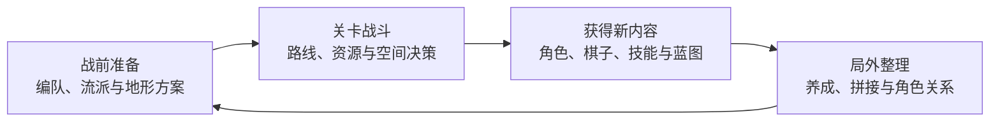
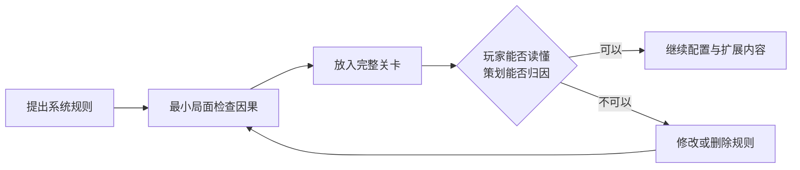

# 01｜项目概览：从系统构想到可玩战斗切片

[作品集首页](../../README.md) · [项目入口](README.md) · **01 项目概览** · [02 核心系统](02_核心系统_高台与地形博弈.md) · [03 关卡设计](03_关卡设计_面粉关.md) · [04 设计迭代](04_设计迭代案例.md)

> **预计阅读：** 速览约 45 秒｜完整阅读约 6 分钟　　**重点展示：** 玩法说明、目标拆解、范围控制、验证优先级与整体设计能力

**电梯总结：**《代号：地形》是一款类《火焰纹章》的个人原创回合制战棋。玩家操控多名角色在方格地图上行动，计算射程、反击、追击与击杀阈值；游戏进一步允许玩家在战前改造部分地形，并在战中建造或破坏高台，主动改变之后的交战距离。项目的长期循环还包含技能、角色关系、特殊棋子和地形蓝图，但这些内容最终都要回到关卡战斗中接受验证。因此我先制作“面粉关”这张能够从开局打到 Boss 的完整关卡，用路线、敌人、有限资源与 Boss 房检验底层玩法，再依据实机结果继续修改系统。

[▶ 先看早期实机演示](../../media/terrain/videos/codename-terrain-early-gameplay.mp4)（部分规则与界面已经更新，本文记录现行设计。）

## 一、这是一个怎样的游戏

《代号：地形》的基础框架接近《火焰纹章》：玩家以回合为单位操控一支队伍，在方格地图上移动角色，选择攻击、治疗、使用物品等行动。武器具有明确射程，角色可能反击或追击，因此玩家需要计算敌方下一回合能走到哪里、谁会受到攻击、一次集火能否完成击杀。关卡通常以击败 Boss 或完成地图目标结束。

项目的主要变化在于，**地图条件可以被玩家主动修改**。战前，玩家会在有限额度内改变部分格子的地形，为编队准备可利用的高台、掩体或路线条件；进入战斗后，队伍中的建筑师职业还可以继续建造、降低或破坏高台。高度会推动武器的最小和最大射程，高处角色能够攻击更远的目标，过近的敌人也可能落入射程盲区。敌人同样可以利用高台，因此一处安全阵地可能在之后被拆除、被反向利用，或者随着敌人推进失去价值。

举一个最简单的局面：玩家可以立刻向前攻击一名敌人，也可以让建筑师花掉当前行动，在后方搭起两层高台。直接进攻能立刻减少敌军数量，但角色会进入敌方反击和下一回合的威胁范围；先搭高台会放弃眼前的一次输出，换来之后数回合更远的攻击距离。若后续敌人都会经过同一处窄口，高台投资可能十分划算；若敌人已经贴近，或者战线即将转移，这次施工就可能浪费行动。**我希望玩家反复计算的是施工时机、阵地寿命和敌我距离，而非看到高台后固定堆满层数。**

## 二、完整循环为什么围绕关卡战斗展开

项目最初起于一个比较天马行空的地形构想，早期也考虑过很多可以扩展的系统。实际开发后，我逐渐把判断标准收紧：一项内容需要能够改变玩家下一场战斗的选择，或者让玩家产生尝试新战术的欲望，才值得进入完整游戏。

比如说，玩家学习一套新的流派技能后，需要找一张关卡验证它怎样改变击杀线和阵形；角色关系可以通过小品级关卡展开，奖励专属装备或双人能力，随后再回到主线战斗中尝试；抽到特殊棋子后，玩家会寻找适合它的编队和地图；前一关探索得到的地形蓝图，则可以用于局外拼接，也可以在后续关卡中用于地形改造。玩家在战斗中获得发现，带回局外整理，再带着新的组合进入下一场战斗，形成持续的正向循环。

这套循环给外围系统划出了很清楚的边界。技能、养成、关系与收集都要能够反哺战斗；关卡也需要容纳不同组合，给玩家留下验证空间。对于个人独立项目，这种集中方式还能减少资源分散：先把最能决定作品气质的战斗做扎实，后续新增内容才有统一的落点。

## 三、为什么先完成“面粉关”

最小实验场可以证明高台的射程计算和建造规则能够运行，却无法回答一次施工会不会连续解决多批敌人，也无法回答玩家有其它路线时是否仍愿意使用它。完整的局外循环制作成本更高，一旦底层战斗发生大改，返工会扩散到养成、奖励和内容投放。因此，**当前第一个完整验证目标是一张能够从开局打到 Boss 的大型战斗关卡。**

“面粉关”分为野外、厨房和城堡三个区域。开局提供 A、B 两条可以交叉的路线：A 线有距离玩家更近、会主动出击的敌人，能够把初见玩家自然地引向厨房；敌方厨师会拾取面粉并进行烹饪，拖延时间会让敌军逐步获得增益。B 线允许玩家在危险范围外先布阵，再通过堵口单位、远处高台火力和自然分批到场的敌军检验阵地。进入城堡后，玩家还要处理动态高台和 Boss 的警戒攻击。

面粉同时承担两种用途。玩家可以把它用于烹饪，获得本关持续的队伍增益；也可以在封闭空间撒下粉尘，再用带有“热”标签的攻击引发爆炸，削弱高压房间中的单位。敌方也会搬运和消耗面粉。玩家走哪条路线、花多少回合处理厨房，会直接影响后续资源量和敌人强度。高台、路线与面粉由此进入同一个决策链，关卡也能检验战前改造、战中施工、资源使用和基础走位各自适合解决什么问题。

## 四、关卡实践如何反过来修改系统

高台早期同时提供射程变化、近战抵挡和通用伤害加成，希望形成攻防兼备的选择。进一步设计关卡后，我发现通用伤害没有成为整体数值平衡的基准，玩家搭建高台时也不该主要为了每层增加的一点伤害。它与射程变化相对独立，却要求所有敌人的生命值为这项增益预留空间，还会增加首次学习高台时的规则数量。

当前版本已经取消高台自身的伤害加成。射程变化继续承担高台的主要价值，近战关系和四层以上的孤立／禁疗构成收益与代价；原有伤害收益转入建筑师的“高地应援”，并提高为每层 `+2`。普通角色学习到的高台规则更集中，建筑师则通过技能保留了利用高台补足伤害的能力，同时增加了角色范围和站位要求。这个改动来自关卡对系统职责的反查，详细过程见[核心系统篇](02_核心系统_高台与地形博弈.md)。

B 线实机还暴露了另一个问题。玩家为了击杀堵口敌人搭好的高台，可以继续覆盖自然分批到场的后续单位，原本应当形成的推进压力被一次投资全部消化。我曾尝试用综合空间评分让敌人识别火力网、调整推进位置；实机中，敌人前进、停步和回撤的原因越来越难判断，异常也很难归因到某一项公式或参数。继续调试开始挤占敌人配置和完整路线测试时间，于是方案被停止。这里留下的成果是问题定义和止损标准，详见[设计迭代篇](04_设计迭代案例.md)。

## 五、当前做到哪里

我把项目推进分为整体框架、核心规则、纵向切片和投递包装四层。高台、地形改造、基础战斗与面粉相关机制已经能够运行，并完成多轮局部验收；当前重点是面粉关完整路线中的敌军节奏、数值阈值、Boss 房与信息呈现。项目尚未开展外部玩家测试，文中提到的“验证”均指策划推演、最小场景、人工实机和项目内验收。

| 阶段 | 已形成的结果 | 当前判断 |
| --- | --- | --- |
| 整体框架 | 确定战前准备、关卡战斗、局外整理与成长回流的关系。 | 外围系统都要说明自己如何促成下一次战斗尝试。 |
| 核心规则 | 高台收敛到射程变化、近战关系和高层代价；伤害收益转入建筑师技能。 | 通用规则已经更集中，仍需随完整关卡继续校准边界。 |
| 纵向切片 | 面粉关形成 A／B 路线、厨房资源、城堡压力与多种解题手段。 | 当前继续排查低成本通解、节奏断点与信息盲区。 |
| 迭代方法 | 建立最小局面验证、问题归因和停止复杂方案的标准。 | 系统优化不能长期占用关卡配置与完整游玩时间。 |
| 投递材料 | 已有早期实机视频与四篇案例文档。 | 待面粉关稳定后补录正式视频，并制作教学＋核心战斗试玩切片。 |

## 六、后续规划及方向取舍

近期工作仍围绕面粉关：先完成整关节奏与信息表达，再录制正式视频，并把基础教学和 B 线第一波打包为面试用试玩内容。试玩切片会让玩家在有限时间里完成一次完整的判断过程：看懂敌人和地形，决定如何布阵，付出行动或风险，最后看到战术结果。

远期内容更适合采用玩家自选限制的关卡挑战。肉鸽要求持续制作大量短平快关卡，其成长结构又容易让角色与技能构筑成为主要游玩对象，好的组合可以越过原本需要仔细处理的地图问题。当前项目已经投入较多精力制作大型、精密的战棋关卡，核心乐趣也更偏向战术执行数回合后得到验证的满足感，因此没有继续采用肉鸽方向。

自选限制可以直接复用既有关卡。我的设想是调整某条路线或某种战术的实行成本，例如让厨房更难控制、限制一类地形改造，或者改变一组敌人的到场关系。玩家熟悉的解法因此需要调整，进而看到地图的另一面。这个方向受到《明日方舟》危机合约启发，但会围绕《代号：地形》的路线、资源和施工规则重新设计。它主要服务通关后的核心玩家，解决流程结束后的继续钻研；新玩家是否愿意购买、能否顺利进入游戏，仍要依靠音画吸引力、叙事与战斗结合的轻度教学，以及主流程中持续展开的系统反馈。

## 本篇的四项核心判断

| 判断 | 具体依据 |
| --- | --- |
| **关卡战斗是整个项目的中心。** | 技能、角色关系、棋子与地形蓝图都要在后续战斗中产生新的尝试。 |
| **先做纵向切片。** | 完整关卡能够尽早暴露系统边界，减少外围内容完成后的整体返工。 |
| **关卡有权淘汰系统效果。** | 一项效果能够运行，却没有进入平衡基准或有效决策时，应当转移或删除。 |
| **长期内容优先复用精密关卡。** | 自选限制更符合当前玩法重心和个人制作成本，具体形式仍需后续验证。 |

---

**继续阅读：**系统规则见[02｜高台如何从复合增益收敛为空间决策](02_核心系统_高台与地形博弈.md)；关卡设计见[03｜面粉关如何组织引导、路线与多解性](03_关卡设计_面粉关.md)。
