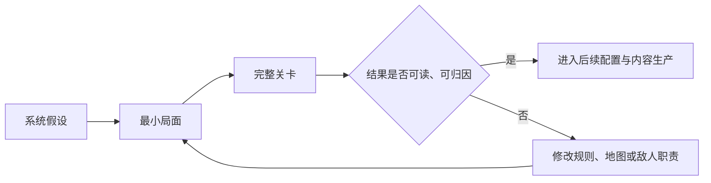

# 01｜从系统构想到可玩战斗切片

[作品集首页](../../README.md) · [项目入口](README.md) · **01 项目概览** · [02 核心系统](02_核心系统_高台与地形博弈.md) · [03 关卡设计](03_关卡设计_面粉关.md) · [04 设计迭代](04_设计迭代案例.md)

> **预计阅读：** 速览约 45 秒｜完整阅读约 5 分钟　　**重点展示：** 目标拆解、范围控制、验证优先级与整体设计能力

**电梯总结：**《代号：地形》的长期构想包含战前配置、关卡战斗、角色成长和局外地形拼接，但我没有同时铺开所有系统，而是把关卡战斗确定为整个项目的体验枢纽，并用“面粉关”作为首个纵向切片。技能、角色关系、特殊棋子与地形蓝图只有在促成下一次战斗尝试时才有价值；反过来，关卡实机也持续暴露系统边界，推动高台规则简化和复杂 AI 方案停止。本篇展示的是如何把个人项目的创作构想收敛为可验证、可继续扩展的制作路径。

[▶ 先看早期实机演示](../../media/terrain/videos/codename-terrain-early-gameplay.mp4)（部分规则与界面已经迭代，本文描述当前设计。）

## 一、先确定体验枢纽，再决定系统是否值得制作

项目最初来自一个较开放的设想：如果战棋玩家不仅能利用地图，还能主动建造、破坏和重新组合地形，是否可以改变一张地图的“答案空间”？早期构想并非从严密的产品命题自然推导而来，但进入实际开发后，我逐步把评价标准从“这个想法是否有趣”转为“它能否稳定地产生玩家决策，并且值得投入制作成本”。因此，现阶段作品集不试图证明最初灵感多么完整，而重点呈现我如何收窄问题、建立规则边界并用关卡检验它。

完整游戏循环中，关卡战斗是连接其它内容的枢纽。玩家学习新流派技能后，需要在战场上验证它如何改变击杀、站位和行动顺序；角色关系带来的小品关卡、专属装备或双人能力，会继续打开新的战术尝试；特殊棋子的获得应促使玩家寻找适合测试的关卡；前一关探索得到的地形蓝图，则可以在基地拼接，也可以在后续战斗中通过地形改造验证。设计目标不是用外围系统分散玩家注意力，而是让每一次发现都自然产生“下一步想试什么”的动力。

这一循环也限定了系统的立项标准：外围内容必须能改变玩家下一场战斗的判断，而战斗必须有足够清晰的规则和反馈，才能承接这些变化。对于个人独立项目，这种集中化开发比同时追求多个彼此独立的系统更有优势——资源可以优先投入最能定义作品气质的部分，新的内容也有明确的回流方向。

## 二、为什么首个验证目标是一张完整战斗关卡

如果高台只能在孤立实验场中证明“功能能够运行”，却不能在路线、敌群和资源压力中持续形成取舍，那么角色成长和局外循环越多，后续返工范围越大。因此我先选择一张大型关卡作为纵向切片，让它同时承担系统验证与关卡体验验证：开局路线检验玩家如何读取威胁，厨房让地形之外的资源进入时间压力，城堡和 Boss 房再检验动态射程与阵地拆解。它不是完整游戏的缩小清单，而是一组围绕核心战斗组织的连续问题。

“面粉关”之所以适合承担这一任务，在于它能够把同一套机制放进不同语境。A 线利用靠近玩家的主动敌人和厨房烹饪形成自然引导；B 线允许玩家在危险范围外预先布阵，以堵口单位、远程火力和自然分批到场的敌军检验高台阵地是否会成为万能解；面粉既是敌我争夺的烹饪资源，也可以参与封闭空间爆炸。玩家可以战前改变局部地形、战中搭建工事，也可以依靠路线选择和基本走位解决问题。由此，系统设计不再只回答“规则是什么”，关卡设计也不只回答“敌人放在哪里”，两者共同回答“玩家为什么此刻愿意采用这一规则，以及采用后要付出什么”。

关卡实践反过来修改底层系统。例如，高台早期同时提供射程、近战抵挡和通用伤害收益；当我进一步检查其在关卡中的职责时，发现通用伤害没有成为整体数值平衡的基准，也没有构成最值得引导的搭建理由。于是当前版本取消高台自身的伤害加成，把射程改变保留为核心规则，并把伤害收益集中到建筑师的“高地应援”技能中。另一次 B 线实机则暴露已有阵地可以连续无代价处理后续敌群，促使我尝试敌方空间决策升级；当综合评分产生难以理解、难以归因的行动后，又主动停止方案。两次迭代分别说明：关卡既用于证明系统有效，也用于发现某项规则根本不应继续存在。

## 三、从立项到当前：完成度以设计结论衡量

我把项目推进划分为“整体方向—核心规则—纵向切片—投递包装”四个层次，而不以完成多少功能作为阶段成果。当前已经能够运行高台与地形改造、基础战斗和面粉相关机制，并完成多轮局部验收；正在推进的是完整路线中的敌军节奏、数值阈值、Boss 房和信息呈现。外部玩家测试尚未开始，因此文档中的验证均指策划推演、最小场景、人工实机与项目内验收。

| 阶段 | 已形成的设计结果 | 对下一阶段的意义 |
| --- | --- | --- |
| 整体框架 | 确立战前准备、关卡战斗、局外整理与成长回流的循环，并把战斗定为体验枢纽。 | 外围系统必须证明自己如何促成下一次战斗尝试。 |
| 核心规则 | 高台从复合增益收敛为以射程变化、近战关系和高层代价为主的空间规则。 | 可以用统一的距离与行动成本设计敌人和关卡。 |
| 纵向切片 | 面粉关形成 A／B 路线、厨房资源、城堡压力与多种解题手段的框架。 | 当前继续验证完整路线是否存在低成本通解与信息断层。 |
| 迭代方法 | 建立最小局面验证、问题归因和停止复杂 AI 方案的标准。 | 避免系统优化长期挤占关卡配置与完整游玩时间。 |
| 投递材料 | 已有早期实机视频与四篇案例文档。 | 待面粉关稳定后补录正式视频，并截取教学＋核心战斗 Demo。 |

当前最重要的完成度不是“长期循环全部落地”，而是项目已经形成一套可以反复使用的设计语言：改变地形会重画射程和危险区；关卡通过空间、时间和资源让改造有成本；实机结果再决定规则保留、转移还是删除。这个闭环能够继续支持后续制作，也能分别提供系统策划与关卡策划所需的证据。

## 四、后续规划：先完成一次好体验，再讨论更长留存

近期目标是稳定面粉关的完整战术节奏，补齐面向首次接触者的信息呈现，随后录制正式实机，并把基础教学与 B 线第一波打包为面试用试玩切片。试玩内容不追求截取最多功能，而要让玩家在较短时间内经历“读懂规则—形成计划—承受代价—验证结果”的完整过程。

远期内容更倾向于在精密设计的既有关卡上增加玩家自选限制，而不是转向肉鸽。肉鸽需要持续生产更多短平快关卡，其构筑增长也容易让战斗重心从地图解题转向 Build 强度，这与当前项目希望保留的大型关卡、严格阈值和战术延迟验证不完全一致。自选限制模式则可以通过提高某条路线或某种战术的执行成本，使过去的解法失效，促使玩家重新理解地图的另一侧面；其目标不是大幅抬高数值，而是扩展同一张关卡的问题集合。这一方向受到《明日方舟》危机合约启发，但会围绕本项目的路线、地形和资源结构重新设计。

这类终盘模式解决的是核心玩家从完成流程到继续钻研的问题，并不能替代玩家是否愿意购买和完成主流程。更完整的产品顺序应是：音画表现承担第一印象，叙事与战场结合的轻度教学稳定前期体验，逐步展开的系统与紧凑流程支撑完整 RPG 旅程，最后才由自选限制内容服务深度玩家和社区分享。该判断目前只作为远期制作边界，不计入当前完成成果。

## 本篇对应的关键设计判断

| 判断 | 取舍依据 |
| --- | --- |
| 战斗是体验枢纽，而不是众多系统之一 | 外围成长、关系和收集都必须在下一场战斗中产生新的尝试价值。 |
| 先做纵向切片，不同时铺开完整循环 | 越早在关卡中暴露系统边界，越能降低外围内容完成后的整体返工。 |
| 用关卡反向淘汰边缘规则 | 一个效果即使能运行，若不成为平衡基准或有效决策，也应转移或删除。 |
| 终盘扩展优先复用精密关卡 | 自选限制更符合当前核心体验与个人制作成本，远期仍需独立验证。 |

---

**继续阅读：**系统规则见[02｜高台如何从复合增益收敛为空间决策](02_核心系统_高台与地形博弈.md)；关卡承载见[03｜面粉关如何组织引导、路线与多解性](03_关卡设计_面粉关.md)。
