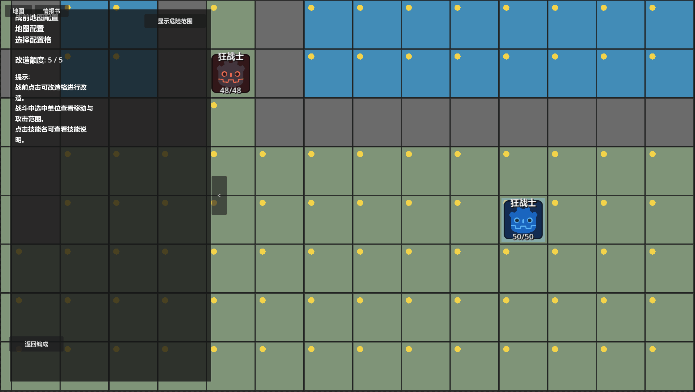

# 《代号：地形》｜项目主页

> **独立 SRPG / 战棋项目｜2026.03 – 至今**  
> **负责内容：玩法系统、关卡设计、原型实现、测试迭代与项目推进**  
> **预计阅读：约 8 分钟**  
> **推荐阅读：首次了解项目，或需要确认核心玩法、设计原则与当前完成度。**  
> 当前状态：核心系统已完成可玩验证，“面粉关”单关纵向切片正在进行完整敌军节奏、路线平衡与表现层制作。

[返回作品集首页](../../README.md) · [核心系统案例](02_核心系统_高台与地形博弈.md) · [关卡案例](03_关卡设计_面粉关.md) · [迭代案例](04_设计迭代案例.md) · [原始工作文档](source-docs/README.md)

## 30 秒摘要

**《代号：地形》是一款围绕“玩家主动创造战术地形”展开的回合制战棋游戏。**

传统战棋中的地形，大多是玩家进入关卡以后被动读取和利用的既有条件。我最初想解决的问题很简单：**如果玩家能够主动改变这些条件，会发生什么？**

由此，项目逐渐形成了“战前地形配置 + 局内地形建造 / 破坏 + 精确射程 + 职业流派”的核心结构。玩家不仅需要判断“这个格子有什么效果”，还需要考虑：我是否值得消耗一次行动去改变这里？这个地形会怎样改变下一回合的攻击范围？敌人能不能反过来利用它？我现在获得的优势，会不会成为之后的限制？

换句话说，我希望地形从地图背景变成一种真正参与战术循环的资源。

---

## 核心玩法｜从利用地形，到创造地形

目前项目最核心的系统是**战前地形改造**与**局内高台构筑**。

**战前**，玩家可以在有限额度与允许区域内调整部分地形，将其改造为玩家已获得的地形蓝图中的某个，为自己的阵容提前创建战术展开点；
**局内**，则可以通过建造、拆除高台动态改变战场空间。

*战前地形改造会消耗有限额度；这里将普通地块替换为冻结浅滩，提前改变之后的接敌条件。*

高台目前主要改变**武器的最小 / 最大射程、近战交互与单位行动状态**。

高台有三项核心机制：
**高度会同时将武器的最小和最大射程向外推动**，因此“站得越高”并不意味着无脑变强：射程会变远，同时也会产生更大的近身盲区；
**4层以上的高台会进入“无法被治疗且无法移动”的高成本区间**；
**能够吸收近战攻击，但每实际吸收一次攻击都会被拆除一层**。而搭建或拆除高台本身也会像攻击、待机一样结束单位本回合行动。

→ [查看系统案例：高台与地形改造系统](02_核心系统_高台与地形博弈.md)

---

## 纵向切片｜为什么选择做一张 40×30 的“面粉关”

在《代号：地形》里，关卡战斗是作为最核心的内容，将所有边缘系统串联起来的枢纽。**局外所做的玩法，除了玩家通过地形拼接可能触发某些彩蛋外，绝大多数都服务于角色养成和战斗丰富度，最终都要反哺到关卡战斗中**。举例说：

**基地的技能学习系统**：流派技能学习后，玩家需要验证新的流派如何影响战局；
**角色羁绊系统**：角色羁绊的触发，终点为小品级的关卡，而后得到的奖励也是专属装备、双人技能等，从而进一步激发玩家在接下来关卡中尝试、验证的欲望；
**地形拼接与棋子招募系统**：新棋子的抽取一方面作用于技能学习，另一方面，特殊棋子的获得也会促使玩家进一步寻找关卡进行尝试游玩；
**地形蓝图系统**：前一个关卡中探索得到的新地形蓝图，除了在基地尝试拼接外，也需要在后续的关卡中通过地形改造的方式进行尝试。

我希望游戏能够做到：**玩家在游戏中得到的发现，都可以引发其下一步继续探索和尝试的动力**，从而集中整个作品的气质，也更方便展现作品最核心的东西，这是针对独游更有优势的开发模式。

“面粉关”地图承担的是一次比较完整的压力测试：

玩家需要在野外 A / B 两条路线之间选择推进方式，处理不同的敌人组合与空间压力；厨房区域存在可以被敌我双方共同消耗的“面粉”资源，既能够用于烹饪强化，也能够参与粉尘爆炸等环境交互；进入城堡后，关卡逐渐转入更紧密的空间博弈，并最终进入 Boss 房。

例如目前已经基本完成设计的 A1 / B1，就承担了不同的玩家引导职责：一侧强调更自然地接触高台与基础地形，另一侧则通过更严密的敌军站位和处理距离，让玩家开始真正判断“什么时候值得搭台，什么时候应该前压，什么时候应该后撤”。由此也分化出两种难度不同，但都可以完成攻克的路线。

选取面粉关作为纵向切片，实际上也是在关卡设计和开发中进一步认识系统边界，从而不断革新系统、打磨底层系统，因为一个靠得住的局内表现才能让整个游戏立得住。实际上**在开发过程中所发现的很多问题，也反哺了系统优化**。在这种打磨下让战斗设计获得立得住的设计哲学，而后其它系统才能得以围绕其展开。因此以最核心的战斗切片作为了游戏的首个验证目标。

→ [查看关卡案例：面粉关关卡设计](03_关卡设计_面粉关.md)

---

## 设计原则｜高难度首先应该是可理解的

《代号：地形》目前的关卡切片主要面向愿意阅读信息、推演行动顺序的战棋玩家，“面粉关”本身也定位为中后期的展开关卡，因此我**并不排斥较高的战斗压力，但希望这种压力来自玩家能够理解的规则和形势。玩家无需借助wiki、解包等外部手段，即可完成每次失败或成功的归因。**

玩家可以不知道最优解，却应该知道自己的行动大概会带来什么结果；可以因为判断错误损失单位和资源，却不应该因为隐藏机制、错误范围或无法解释的敌人行为受到惩罚。

因此，项目中会公开战斗预测、当前 / 潜在危险范围、敌人技能与地形效果；情报书系统也不是单纯的“教程菜单”，而承担着把规则、战场记录与一定的叙事信息整理给玩家的职责。

与此同时，**“信息透明”也不等于把解法直接告诉玩家**。例如面粉爆炸这类机制，我更希望玩家先在事件与环境中意识到“好像可以这样做”，然后再通过操作真正验证自己的猜想，而不是在关卡开始时直接弹出一页教学告诉玩家标准答案。

这是我目前比较在意的一种平衡：

**规则应该清楚，但发现规则的过程仍然可以有惊喜。**

---

## 当前阶段｜这个项目现在做到哪里了？

目前已经完成或进入稳定验证的内容包括：

- 基础战斗、命中 / 必杀 / 反击 / 追击与战斗预测；
- 战前编队、流派切换与有限地形配置系统；
- 局内高台建造、拆除及其与精确射程的完整交互；
- 多类职业、技能与敌人配置；
- 面粉、灶台、烹饪、粉尘爆炸及敌我共享资源规则；
- 教学事件、特殊单位 AI、情报记录等关卡机制；
- “面粉关”野外部分的大量敌军配置与路线验证。

**当前主要工作集中在完整关卡节奏与敌人职责**。

其中波次 A1 / B1 已进行了较深入的实机测试；A2、B2 仍在持续调整，城堡与 Boss 区域也将在前序节奏稳定后继续进行完整验证。

正式 UI、美术、音频与完整发布包仍属于后续阶段。目前正在同步进行视觉方向试点，但这并不是一个已经完成美术包装的成品项目。

半年来的个人开发，可以总结为几个问题：

**一个最初非常大的游戏构想，怎样被逐步拆成可以验证的问题；一个机制怎样在实机里暴露边界；一张关卡又怎样反过来要求系统继续变化。**

---

## 继续阅读

**系统设计**  
→ [高台与地形改造系统](02_核心系统_高台与地形博弈.md)

**关卡设计**  
→ [面粉关](03_关卡设计_面粉关.md)

**设计迭代**  
→ [设计迭代](04_设计迭代案例.md)

**快速了解项目**  
→ [实机视频](https://xcnwfl5k7vkb.feishu.cn/file/V6tMb1tTzo4848xQtgEcx3E2njb) ｜ [试玩 Demo（待补充）](../../README.md#材料状态)

**核验原始工作**  
→ [关卡策划案、阶段记录与验收矩阵](source-docs/README.md)
