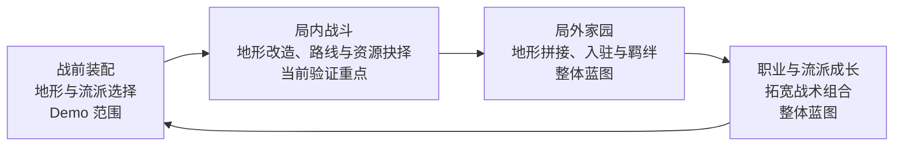

# 01｜主案例：从高台系统到“面粉关”

> 阶段说明：本案例写于单关 Demo 的敌军节奏、Boss 房与数值平衡阶段。已验收的关卡机制与仍待完整体验验证的设计目标会分别说明；五月的整体循环是设计蓝图，并非当前版本的功能清单。

## 设计问题：玩家能否改变战棋的“答案空间”

《代号：地形》是一项以地形改造为核心的回合制战棋设计实践。玩家仍要考虑单位位置、武器、技能、命中与伤害，但战场不再只是给定的棋盘：战前可以用有限配置机会改造地形，局内也可以通过建造或破坏高台改变之后的攻击距离和安全区域。我希望玩家面对的不是“哪个格子加成最高”这一道静态选择题，而是“此刻应直接进攻、花行动布势、诱使敌人进场，还是放弃已有阵地换一个交战方向”。系统策划的难点在于让改造产生足够明显的战术收益，却不吞没角色和武器的差异；关卡策划的难点则在于用地图、敌人和资源压力，让这一规则以玩家能读懂的方式反复成为决策，而非仅在说明书中成立。

项目立项时的目标比一张关卡更大。五月末整理的策划案 Part 2 以两张循环图提出：战前装配地形与流派进入战斗，局内的探索、资源和经验返回局外；家园中的地形拼接不仅用于生产，还可形成招募栖息地、角色入驻与羁绊场景；职业与流派的长期培养再拓宽下一次战前配置。第二张图把家园这一步展开为“地形组合—栖息地／设施／羁绊—角色与资源—流派成长”的关系。它表达的核心思考不是系统越多越好，而是让玩家在战斗内外重复使用同一种设计语言：地形既决定眼前战术，也可在未来承载经营、招募和叙事。此处的家园、招募、羁绊及长期培养仍属于整体游戏蓝图；当前面粉关 Demo 只验证战前选择与局内战斗如何接成有意义的一次循环。

收束制作范围是设计判断的一部分。如果在首个展示版本里同时追求家园、招募、养成和完整关卡，很难判断玩家是否真正理解了地形战术。因而当前选择一张包含开局分线、厨房资源争夺与城堡 Boss 房的单关作为验证容器：它足以检验战前地形／流派配置是否影响入场策略，也能让局内行动产生新的问题与反馈，但不把尚未落地的长线循环写成 Demo 已有内容。对于招聘阅读者，这张关卡既是“高台规则如何被验证”的系统案例，也是“敌人职责和体验节奏如何被组织”的关卡案例。

## 核心机制：高台不是单纯的伤害奖励

高台的关键效果是改写交战几何。高度会同步改变武器的最小与最大射程，因此站得更高并非永远更安全：远处目标可能进入射程，近处目标却可能落入无法攻击或反击的盲区；我方用高台架起火力线，敌方也可能拆除、利用或改造它。若某个高度让一名敌人从“本回合无法处理”变成“可以安全击杀”，建造就不仅是一个额外指令，而是把当前行动换成后续回合的站位、击杀与生存机会。相反，双方贴近后若再无足够时间兑现投资，直接进攻更有价值。于是高台真正需要关卡支持的，是“布势—接敌—局势变化—再布势”的空间与时间节奏，而非要求玩家每次战斗先固定堆塔。

规则强度经过了收束。五月版曾设想每层额外伤害 +2；进入单关验证后，将常规战斗伤害调整为每层 +1，普通格玩法上限设为 5 层，仅 Boss 房特定角塔暂用更高上限。理由是高台已经改变射程并带来其他生存收益，若直接伤害过强，最优选择很容易退化为反复施工。当前仍允许在敌方单位脚下建设：抬高敌人可能改变它的射程环，甚至创造“灯下黑”与诱导空间；这是一类能体现项目特色的解法，不宜仅凭纸面担忧删掉。后续若完整关卡证明它成为稳定、低成本的万能答案，再从能力来源、目标格或关卡特殊规则收束。这个判断同时体现我对系统边界的要求：保留可推演的创造性，限制无需推演的重复收益。

## 用“面粉关”验证：每一区域都承担不同问题

面粉关把规则放入一条可选择、可折返的推进路线。开局野外区域分出偏厨房迂回的 A 线和偏城堡攻坚的 B 线；前者应以较可控的压力让玩家首次发现高台的价值，后者更早把玩家放进敌方高台火力与守门压力之下。两条线不只是“简单路”和“困难路”：A 线让玩家付出绕行与厨房争夺的行动，B 线则要求更早处理高压阵地，并以更高价值的战利品补偿风险。折返和混合推进始终是可能的，因此关卡不能只对设计者预想的单一路线成立。当前敌军职责和数值仍在实机打磨，路线强度不是已证实的最终平衡结果。

微观敌人配置从玩家第一波具体判断开始。A 线首组的设计目标不是一次教完武器克制、地形、资源和高台，而是先用主动接敌、浅滩／树林形成的通道、预设空高台以及一名带“坚韧”的前排敌人，展示高度为何改变击杀线：平地上看似足够的一击留下少量生命，高台提供的增量便有了清晰用途。随后观察我方是否能在接敌前辨认这处机会、是否会为了占台承担额外危险，以及没有占台时是否仍有合理补救。早期测试显示这一组的生存压力过高，因而树林被改为敌我对称的回避 +20，部分敌人的生命也向下调整。这里重要的不是某个固定敌人数值，而是“敌人负责提出哪一道战术题、地形如何让玩家读出答案”的配置方法。

厨房让空间选择进一步变成资源选择。有限面粉可用于烹饪，换取本关内全队增益；也可在封闭空间配合热源爆炸，作为高压房间的破局资源。敌方厨师同样搬运与消耗面粉、推进敌我共享的增益顺序，因而玩家可以抢厨房、阻止敌方烹饪，也可以暂时放弃厨房而更快攻城，但不应无代价地忽略它。首次爆炸由友方斥候与固定敌军行动在关内展示，情报书再提供可回看的规则：先让玩家看到现象，再让玩家确认条件。厨房机制与教学事件已通过相应阶段验收；它能否在完整关卡中形成“有价值但非唯一正确”的支路，仍需结合敌军节奏检验。

城堡与 Boss 房回收前面的学习。角落辅助敌调整远程敌脚下高台，使下一次射程环变化有可观察的因果；Boss 的警戒攻击把“在其范围内结束行动”变成风险，不让玩家只靠冲入房间待机推进。玩家理应能够通过门口站位、拆解角塔、诱导射程、提前布势或保留面粉寻找突破口，而不被未知规则惩罚。目前要验证的不是可列出多少理论解法，而是在完整实机中这些解法各自需要什么代价、玩家能否提前看到危险，以及是否有一种低风险策略绕开整张关卡。Boss 房具体敌军、数值与难度仍处于阶段三，不宣称已平衡完成。

## 实机迭代与当前判断

一轮从 A 线折返 B 线的测试暴露了高台的跨回合复利：玩家先在较安全区域完成建设，再让后续敌人进入同一条已成形的火力网，原本应连续施压的敌群被较低成本地消化。这一发现推动我重新审视 B 线的敌人触发、威胁距离和火力覆盖，而不是只加敌人生命。曾尝试让通用敌人根据多项空间收益综合决定停留或推进，以对抗预设阵地；但 A/B 线实机未得到稳定、易读、可归因的行动，方案已完整撤回。当前坚持先用清晰的敌群职责、地图分区与可读的触发方式制造选择；若再次尝试复杂行为，先在最小局面里定义可观察的成功标准。另一次迭代把树林从隐含的索敌优先级控制简化为敌我对称回避加成，原因同样是初见玩家需要从战场反馈理解风险，而不是猜测幕后评分。详细问题、假设和回退条件见[设计迭代案例](04_设计迭代案例.md)。

从立项到当前，项目推进经历了从“完整游戏为何需要地形”到“单关如何证明地形有用”的收束。以下时间线只列设计与体验里程碑，不以技术任务数充当策划成果：

| 时段 | 设计推进 | 当前判断 |
| --- | --- | --- |
| 五月｜整体框架 | 提出战前装配、局内战斗、家园地形拼接和流派培养的双层循环；高台是局内最先验证的核心规则。 | 长线循环保留为蓝图，不能计入 Demo 完成度。 |
| 七月｜规则收束 | 围绕高度收益、敌人脚下建造和 Boss 角塔，调整普通层数与伤害强度，保留可创造战术的边界。 | 规则可进入关卡验证，强度仍需用多路线测试。 |
| 八月｜单关闭环 | 确定展示关卡的体验目标与范围，完成关卡编成及厨房资源／教学事件的阶段验收。 | 机制能在同一关卡中产生局面，不等于节奏已完成。 |
| 九月至今｜关卡打磨 | 细化首组敌人和路线职责，检验高台跨回合收益，撤回不可读的敌方空间评分试验。 | 敌军、Boss 房与数值仍在实机迭代。 |
| 后续｜公开展示 | 先稳定完整游玩的战术结论，再打磨信息与视听反馈、录制短视频、截取代表性试玩切片。 | 视频、外部试玩和公开 Demo 均未宣称完成。 |

下一步先记录多种路线和编队下的回合数、关键击杀与生存阈值、面粉使用、敌方烹饪进度、减员和 Boss 房解法，再据此判断问题属于敌人配置、地图结构、规则强度还是信息呈现。待这些战术结论稳定后，才适合完成面向首次接触者的操作与预测界面、视听反馈、公开录像，并从完整关卡中截取约 30 分钟的代表性试玩切片。当前没有外部玩家测试数据或已公开 Demo，本案例所称“实机”均指阶段性局面与人工游玩验证。

## 值得单独讨论的设计思考

- **让规则服务于选择，而非功能展示。** 高台既应给我方创造战术机会，也应让敌方形成可拆解的压力；若“多建几层”对所有局面都有效，系统就没有真正扩展答案空间。
- **先计算强机制的成本，再决定是否禁用。** 在敌人或 Boss 脚下施工可能形成强解，但它需要行动、站位与承压；只有完整游玩显示其低成本、稳定跳过关卡时，才应选择最小限制。
- **敌人先有职责，再有数值。** 首组敌人用于让玩家看见高台的击杀阈值，B 线敌人用于考验阵地转换，厨师用于制造资源回合压力；一个敌群若不能提出清楚的问题，单纯调高属性无法补足设计。
- **可解释性是战棋深度的前提。** 敌人行为、潜在危险区和资源增益顺序必须能被观察与复核；玩家不知道结果为何发生时，复杂规则只能制造困惑。
- **迭代允许撤回，而非只做加法。** A/B 线实机让高台复利问题显形，复杂 AI 试验未改善可读性便撤回；保留下来的应是更准确的问题与下一轮验证标准。

系统规则详见[02](02_核心系统_高台与地形博弈.md)，关卡微观设计详见[03](03_关卡设计_面粉关.md)。
