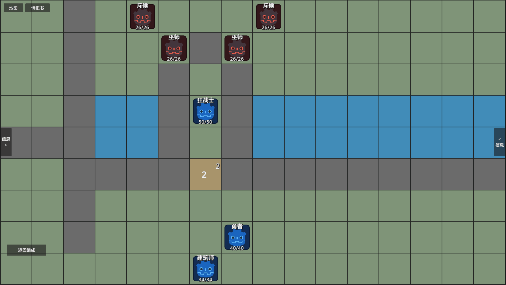
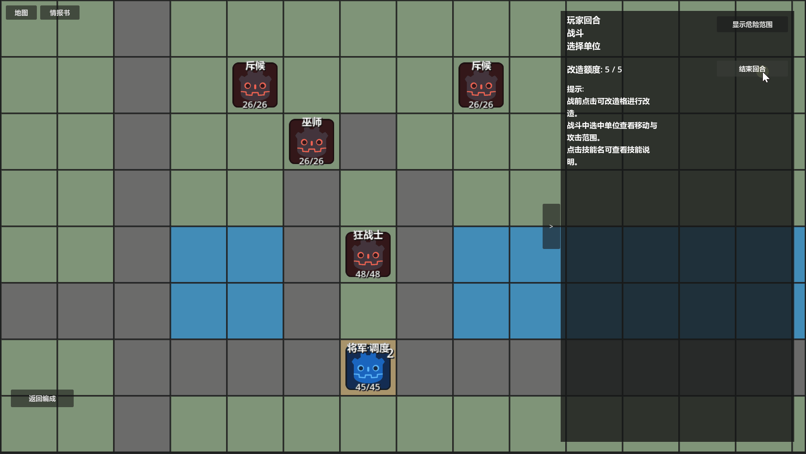
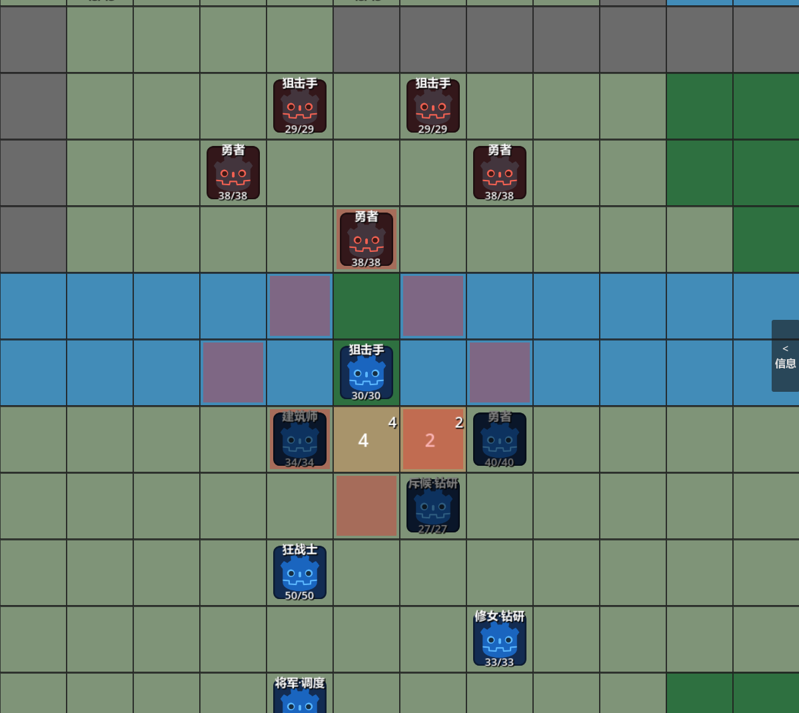
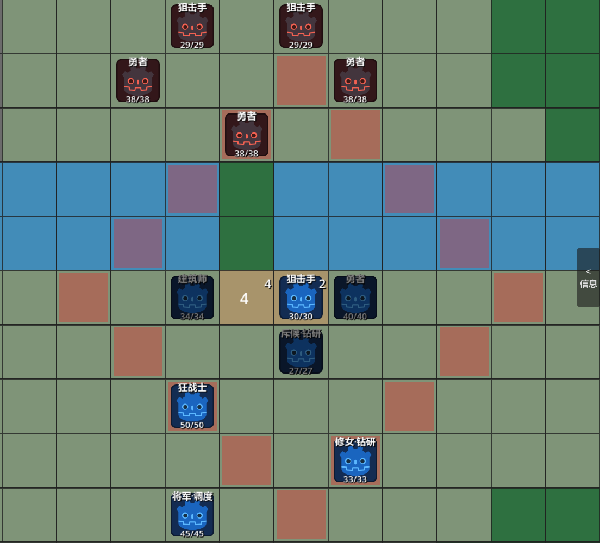
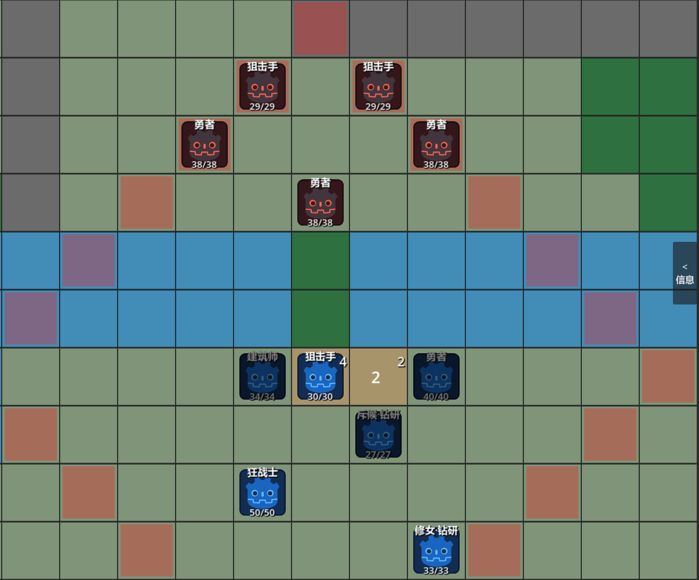
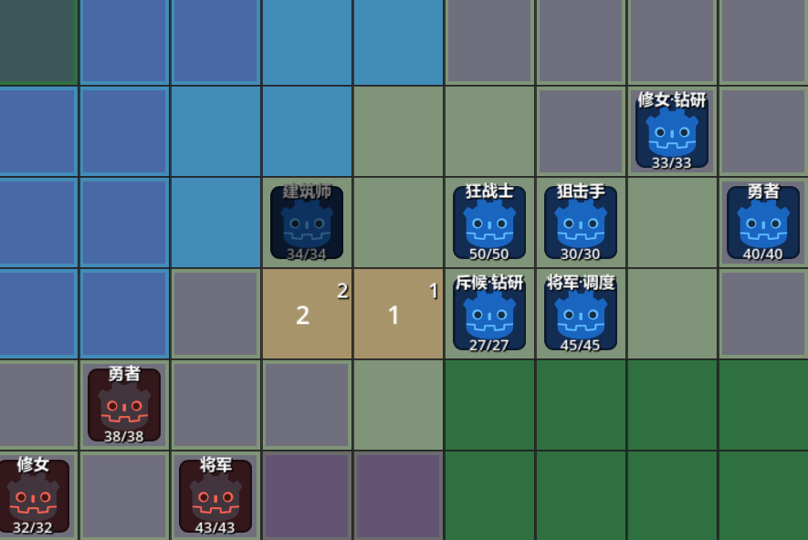
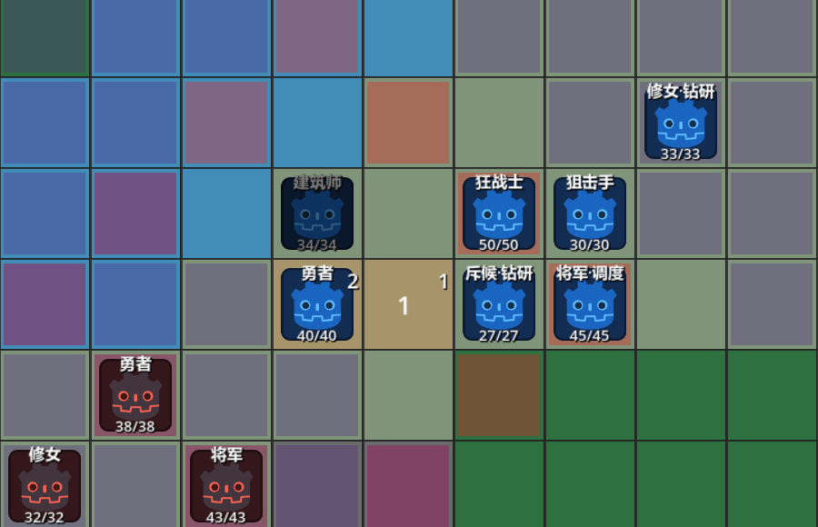
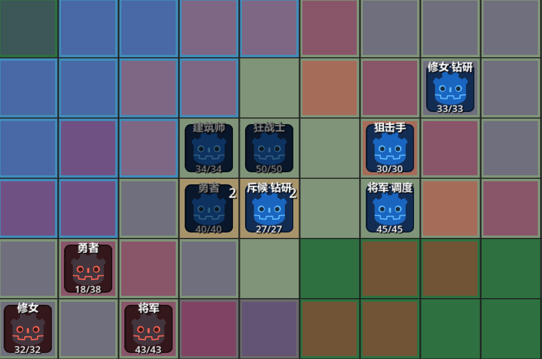

# 从“利用地形”到“创造地形”｜高台与地形改造系统

> **案例类型：系统设计 / 战斗系统 / 实机迭代**  
> **项目：《代号：地形》**  
> **主要展示：核心机制设计、机制边界、行动经济、系统与关卡耦合**  
> **预计阅读：约 10 分钟**  
> **推荐阅读：系统策划岗位优先；关卡策划可重点阅读“强机制不能只靠限制解决”。**

[返回作品集首页](../../README.md) · [项目主页](01_项目概览.md) · [关卡案例](03_关卡设计_面粉关.md) · [迭代案例](04_设计迭代案例.md) · [原始工作文档](source-docs/README.md)

## 30 秒摘要

《代号：地形》最初的核心命题，是**让地形从关卡设计者预先摆好的“题面”，进一步成为玩家能够主动使用的战术资源。**

传统战棋中的地形当然已经能够产生大量博弈：树林提供回避、河流限制移动，玩家需要根据地图条件不断寻找有利位置。但这些条件大多在进入关卡以前就已经确定，玩家主要进行的是“读取地形—利用地形”。因此我最初产生了一个很简单的想法：**如果玩家能够主动创造这些条件，会发生什么？**

这个命题最终被拆成了两个层级：
**战前**，玩家可以消耗有限的“地形改造额度”，把关卡允许改造的格子替换成已经获得的地形蓝图，从而根据阵容和攻略思路提前创造战术展开点；
**局内**，则通过高台的建造与拆除，让战场继续发生动态变化。

前者负责战略铺垫，玩家可以提前处理部分关卡问题，但受到改造额度、允许改造区域与已有蓝图的共同限制，不能在战斗开始前把整张地图重新写一遍；后者则直接进入行动经济，每一次搭建和拆除都会像攻击、待机一样结束当前单位的行动。

*高台建造是全员可用的通用操作；建筑师能够一次选择建造两层，以职业特性提高施工效率。*

---

## 高台究竟改变了什么？

**【问题发现】**
高台早期曾经包含比较直接的伤害强化，但随着实机验证不断推进，我逐渐认为：**伤害加成并不是高台真正值得保留的核心。**它当然能够降低击杀阈值，却很容易和职业、武器、角色自身的数值差异混在一起；即使直接删除，也不会破坏高台真正产生的战术选择。因此**当前版本将继续取消高台本身的伤害加成，把机制重新聚焦到三个更明确的方向：精确射程、近战抵挡与行动状态。**

**【机制介绍】**
高台的第一项核心规则，是**高度同时向外推动武器的最小射程与最大射程**。
例如一把基础射程为 1～2 的武器，在高度+1后，射程会变为2~3，其**整个射程环都会向外移动**，因此获得远距离攻击能力的同时，也会产生越来越大的近身盲区。这使高台无法成为传统意义上的无条件制高点：玩家可以通过高度制造原本不存在的安全攻击位置，也可能因为站得过高而完全无法攻击已经贴近自己的敌人。

第二项规则是**抵挡近战攻击**。当单位处于高台时，高台可以吸收近战攻击，并按照敌方实际完成的攻击次数逐次拆除对应层数。
例如敌人完成一次攻击，高台降低一层；若发生追击，则需要继续消耗下一层。这使高台同时**具有临时防御工事的性质，但这种保护会随着敌人的攻击被真正“拆掉”**。

*近战攻击先由高台承受；敌人每实际完成一次攻击，高台就会被拆除一层。*

第三项规则则用于限制高度收益。当高台达到 **4 层**以上时，站在上面的单位会同时进入**无法移动、无法被治疗**的状态。
继续向上建造当然能够获得更远的射程，却也意味着单位把自己固定在了一个**必须额外投入行动才能解除**的位置。因此，高度本身逐渐形成了一条很清楚的风险曲线：低层数适合灵活调整射程，中高层数开始要求玩家承担位置承诺，而真正的极限射程则需要用机动性与后续救援成本交换。

| 0 层 | 2 层 | 4 层 |
| --- | --- | --- |
|  |  |  |

*同一单位处于 0 / 2 / 4 层时的攻击范围对比：最小与最大射程随高度同步外移，远端覆盖扩大，近身盲区也随之出现。*

---

## 从“地形收益”到“跨回合投资”

**【问题发现】**
实机测试时出现了一种重要的操作：**某个单位这一回合无法有效进攻时，可以先利用行动建立高台，为另一名单位下一回合提前创造攻击位置**。比如勇者站在危险范围边缘负责激活敌人，狙击手帮助其补上一层高台完成远程反击；与此同时，暂时没有输出机会的建筑师又可以提前在狙击手脚下继续施工，使其下一回合不需要再次浪费行动搭台，就能直接利用已经准备好的射程处理敌方后排。

在这个过程中，高台实际上形成了一种很有意思的行动经济：**玩家可以把当前较低价值的行动，转换成未来更高价值的行动窗口。**

**【机制思考】**
这也是它和传统即时战斗增益（例如《火焰纹章 if》中的攻阵系统）最大的区别之一。高台并不一定要求玩家“这一回合搭完，这一回合马上赚回来”，它允许提前规划阵地，**把原本无法有效利用的行动力储存在空间里**，然后在之后敌人进入对应区域时兑现。这种跨回合投资也自然带来了另一面：如果敌人没有按照预想进入火力网，或者玩家随后被迫放弃阵地，那么此前投入的行动不会自动返还；如果撤退时把高台留在原地，**敌人可能反过来利用这些位置**。

因此**高台更接近一种由玩家主动创造、同时可能改变敌我双方未来行动价值的空间资产。**

| 1. 危险范围外施工 | 2. 进入已完成的高台阵地 | 3. 用不同射程形成集中火力 |
| --- | --- | --- |
|  |  |  |

*三张静态局面用于展示阵地形成的不同阶段，并非同一回合的连续操作：施工先占用当下行动，完成后的空间资产再为之后的攻击提供位置。*

---

## 强机制不能只靠限制解决

**【问题发现】**
因为高台可以提前投入行动建立攻击网络，**如果敌人长期停留在固定位置等待玩家激活，那么玩家理论上可以在危险范围外围获得大量施工时间**；一旦阵地完成，后续敌人如果继续按照最短路径进入已经建立好的火力网，**高台的跨回合投资就会产生非常强的复利**。

最初我一度把这个问题归因于敌方 AI 不够聪明，并尝试设计**更加复杂的空间决策模型**，让敌人能够判断责任区域、玩家火力覆盖和下一回合威胁。

**【改动实施与撤回】**
实际实现后，结果并不好。复杂评分使敌人行为对局面细节过度敏感，**同一套规则在不同地图条件下很容易产生难以预测和难以归因的结果**；如果玩家必须理解后台公式才能知道敌人为什么走到某个位置，那么即使 AI 在数学意义上更加“聪明”，对于一款强调信息透明的战棋来说也没有意义。

这次失败让我重新检查了最初的问题：**高台能够提高玩家处理敌人的吞吐量，本身并不一定是系统漏洞，它也可能正是玩家提前投入行动以后应该获得的收益。真正需要设计的，是这种收益能够覆盖到哪里。**

因此后续设计重新回到更简单的空间关系。我开始把**玩家安全使用高台能够触及的距离、承担高层 Debuff 后能够达到的极限距离，与敌人的移动力和攻击距离放到同一套尺度中**考虑：某些高威胁敌人可以在较低成本下通过高台提前处理；某些目标需要继续施工、牺牲机动性或让单位主动前压；还有一些敌人则天然处于高台阵地难以直接覆盖的位置，要求玩家后撤拉扯、放弃阵地或者改变整个进攻方向。

这样，高台和主动推进才真正形成了取舍。

玩家使用高台，不再意味着获得一套能够解决所有敌人的固定阵地；主动向前移动，也不再只是“不愿意使用核心机制”的传统解法。两者分别拥有不同的攻击距离、行动成本、生存风险与未来位置价值，关卡设计需要做的，是不断改变哪一种选择在当前局面下更加值得。

→ [查看设计迭代案例：复杂 AI、阵地战问题与方案废弃](04_设计迭代案例.md)

---

## 当前结论｜机制设计最终要回答“它改变了什么”

高台系统**经历过很多次加法，也经历了越来越多的减法**。早期的伤害加成从 +2 降到 +1，现在准备彻底取消；复杂 AI 被完整实现后又被主动废弃；一些最初看起来像系统漏洞的玩法，在实际测试后又被保留下来，因为它们能够产生新的解法。

这个过程让我逐渐形成了一个对系统设计比较重要的判断：

**判断一项机制时，比“这个机制能做什么”更重要的问题，是“它到底改变了玩家原本的哪一种决策”。**

对于现在的高台而言，我希望答案已经比较清楚：它改变了武器与空间之间的关系，让单位能够用当前行动换取未来行动窗口，并让玩家不断在**射程、机动、阵地、安全与推进速度**之间重新分配自己的资源。

因此，**我并不希望每一道关卡题都要求玩家“必须搭高台才能解决”**。传统战棋方法依然应该成立，只是当玩家真正理解高台以后，会开始主动用新的工具重新处理那些原本熟悉的问题；到了这个阶段，高台才不再是一个附加在战棋底盘上的特色功能，而真正进入了玩家默认的战术思考。

这也是目前《代号：地形》继续设计关卡时，我最希望验证的一件事。

---

## 推荐继续阅读

**查看机制如何进入具体关卡：** [面粉关｜关卡设计案例](03_关卡设计_面粉关.md)  
**查看复杂方案如何被验证和撤回：** [设计迭代案例](04_设计迭代案例.md)  
**核验设计过程与验收口径：** [原始工作文档](source-docs/README.md)
