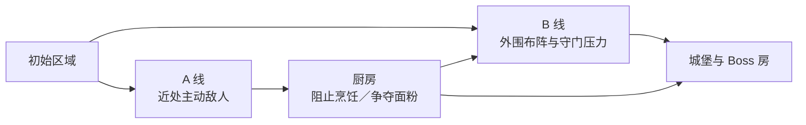

# 03｜面粉关如何组织引导、路线与多解性

[作品集首页](../../README.md) · [项目入口](README.md) · [01 项目概览](01_项目概览.md) · [02 核心系统](02_核心系统_高台与地形博弈.md) · **03 关卡设计** · [04 设计迭代](04_设计迭代案例.md)

> **预计阅读：** 速览约 1 分钟｜完整阅读约 8 分钟　　**重点展示：** 玩家引导、空间组织、节奏设计、多解结构与敌人配置

**电梯总结：**面粉关不是把高台、烹饪和爆炸依次展示一遍，而是用两条可交叉的推进路线组织不同性质的决策。A 线借助靠近玩家的主动敌人和厨师烹饪，引导初见玩家进入厨房并感受隐性时间轴；B 线允许玩家在危险范围外布阵，再用堵口单位、远处高台火力和自然分批到场的敌军检验阵地是否会被重复利用。玩家既可战前改造、战中搭台、争夺面粉，也可依靠路线和基本走位解决问题。本篇展示我如何让敌人、地图和资源共同表达机制，而不是规定唯一标准手顺。

## 一、先规定玩家面对的问题，再划分地图区域

面粉关由野外分线、厨房和城堡／Boss 房组成，但区域不是按美术主题机械切开，而是各自承担不同的认知任务。野外负责让玩家读取第一批威胁并做路线选择；厨房把推进速度转化为面粉归属和敌方强化；城堡则回收前面的空间经验，要求玩家处理敌方高台与动态攻击范围。玩家最终目标是击败 Boss，不被强制清空整张地图或完成所有厨房任务，否则所谓路线选择只会退化成清单顺序。

两条路线并非对称的“简单／困难”按钮。A 线更符合初见玩家对近处高威胁目标的处理倾向，能在较可控的节奏中认识规则；B 线可以从开局直接尝试，但 A 线敌人的主动出击会压缩安全布阵时间，玩家要么先处理这部分敌人，要么承受两侧压力叠加。因此绕开厨房直攻城堡是可玩的解法，却不必成为首次游玩的最优建议。关卡用敌人行动和距离表达难度差异，而不是在入口贴上路线标签。

## 二、A 线：用威胁优先级引导，用烹饪建立时间轴

玩家通常会优先处理看起来马上造成伤害的敌人，再延后处理暂时不构成威胁的单位。A 线第一波利用这一倾向：玩家初始位置更靠近会主动出击的敌人，使“先解决眼前威胁”自然地把队伍带向厨房方向。这里的引导不是封路，也不是弹窗要求玩家选择 A 线；如果玩家决定直接进入 B 线，A 线敌人仍会以实际行动说明这项选择的额外成本。

A 线的厨房进一步把推进速度变成战斗阈值。敌方厨师会拾取面粉并烹饪，为敌军提供增益；玩家如果迟迟不阻止，地图中的资源便逐步转化为敌方战力。这是一种显式机制构成的软狂暴：玩家能看到厨师、面粉和增益结果，进而形成“我需要拦截”的判断，同时关卡获得一条不依赖倒计时 UI 的隐性时间轴。玩家到达厨房时，目标状态是仍保留约 2～3 包面粉——既不足以让资源选择失去意义，也保留烹饪、爆炸或继续保存的余地。这个结果需要通过 A 线敌人数量、强度、厨师移动力与位置共同控制，而不是直接把面粉锁在宝箱里等待领取。

教学只应把玩家带到能够自行提出问题的位置。看见敌人拾取和烹饪后，玩家很自然会尝试“我是否也能使用”；看见封闭空间中的面粉被热源引爆后，也可能进一步思考如何主动复现。设计希望保留发现自己也能做到的一瞬间，而不是立即给出完整手顺。因此，拦截敌方烹饪属于需要清楚表达的关卡压力，“玩家也要烹饪”“玩家应当使用爆炸”则不宜被硬性规定。现有较强提示主要用于功能验收，正式表达会逐步转向场景行为、战场记录和可回看的情报。

情报书在这一结构中不是单纯的教程列表。它可以承担基础机制说明、当前增益顺序记录，以及首次自主烹饪／首次触发面粉爆炸后的角色吐槽与战场简报，使玩家的发现同时获得信息确认和叙事反馈。这个方向的价值在于：规则说明不会抢在发现之前替玩家解题，而是在玩家观察、尝试之后帮助其复核因果。情报书仍属于后续信息呈现方向，不作为当前关卡完成度的依据。

## 三、B 线：让玩家能够布阵，也让既有阵地付出机会成本

B 线敌军采用进入条件后再行动的方式，因此玩家可以在危险范围外观察和布阵。最先接触的两名敌人固定不动、击杀阈值较高，并堵在相对狭窄的位置；如果贸然进入危险区，即便当回合处理掉两名堵口者，远处的高台单位仍难以同时解决，之后较远的可移动敌人又会分批抵达，容易造成减员。更稳妥的初见解法是在外围搭建约 2～3 层高台，用仍具战术灵活性的射程处理堵口敌人，再决定如何打开通路。

这里所谓“后续增援”不是突然刷新的单位，而是敌人初始位置较远，依靠移动距离自然形成不同到场时间。相比无预告刷新，这种做法让玩家有机会从地图位置推测压力何时到来；远处敌人先停在高台安全火力网之外，却能在下一回合移动后威胁阵地，本应促使玩家在继续升高、向前抢攻和原地接敌之间取舍。它直接调用了系统篇中的距离锚点：定点高台的安全触及距离低于敌人移动后攻击的实际触及距离。

早期粗配置却暴露了相反结果。玩家为解决两名堵口敌人搭起的远程阵地，恰好能够在后续敌人每次到场时继续无反击处理；原本用于制造下一回合威胁的空间距离，反而给玩家提供了分批收割窗口。单纯提高敌人生命或伤害无法解决这一结构，因为问题不是某个单位太弱，而是一次高台投资被多个敌群重复兑现。这个偏差后来触发了复杂空间 AI 试验，也成为[设计迭代篇](04_设计迭代案例.md)的主案例。

B 线并不只有战中搭台一种答案。玩家可以在战前针对性改造地形，改变入场后的第一轮攻击环；也可以用更激进的站位抢先处理关键敌人，或依靠基本功在两波到场之间转换阵线。关卡配置的目标不是保证所有方案成本相同，而是让方案分别使用不同资源，并在某些编队或路线顺序下拥有清晰优势。只要搭一座固定高台便能覆盖所有后续局面，就不再是多解，而是其它方案失去存在理由。

## 四、多解不是“什么都能过”，而是不同投入改变不同约束

我希望玩家完成关卡后产生“这一题还能怎样解”的冲动，因此多解性必须建立在可比较的代价上。路线、面粉、战前改造、战中施工和基本走位分别占用不同资源；它们不需要被做成完全等价的菜单，却要让玩家理解自己为何选择这一项、放弃了什么，以及在另一次游玩中可以怎样改变。

| 解题方向 | 主要投入 | 获得的优势 | 需要承担的代价 |
| --- | --- | --- | --- |
| 先走 A 线、处理厨房 | 推进回合与兵力位置 | 抑制敌方强化，保留面粉，较自然地学习机制 | 延后城堡推进，可能错过更直接的进攻窗口。 |
| 开局直入 B 线 | 更高的即时操作与承压能力 | 更早接近城堡与高价值目标 | A 线敌人压缩布阵时间，可能形成双线压力。 |
| 战前针对性地形改造 | 有限的战前配置额度 | 改善首轮攻击环和入口条件 | 方案更依赖事前判断，也放弃其它区域的改造机会。 |
| 战中搭建高台 | 单位行动、站位与回收时间 | 形成可持续的射程和阵地优势 | 可能错过即时攻击，高层还承担孤立／禁疗风险。 |
| 面粉烹饪或爆炸 | 关卡内有限资源 | 改变全队阈值或打开局部高压空间 | 两种用途互相竞争，资源一旦消耗不能兼得。 |
| 基础走位与主动推进 | 生存空间和先手风险 | 不依赖特定角色或资源，也能完成基本解题 | 对威胁范围、行动顺序和伤害阈值要求更高。 |

这一结构也为远期的玩家自选限制模式保留空间。限制不应主要表现为大幅增加敌人生命和攻击，因为战棋的关键阈值对数值变化十分敏感；更合适的方向是提高某条路线、某种资源或某项战术的执行成本，使熟悉的解法不再适用。例如，当厨房路线更难控制、某处地形改造受限或一类敌人的到场关系变化时，玩家需要重新寻找地图的另一种读法。该方向用于延长核心玩家对精密关卡的研究，而不是当前面粉关必须完成的功能。

## 五、当前判断与后续验证重点

面粉关已经形成清楚的区域职责、路线逻辑和资源关系，接下来需要用完整游玩继续校准敌人数量、到场时间、面粉余量、Boss 房压力与信息层级。记录重点不是“最终是否通关”一个结果，而是玩家在哪一处第一次改变路线、哪次施工回收了多少回合、面粉被谁消耗、何时出现减员，以及某个解法是否能够绕开整段关卡。出现问题时，再分别判断来源是地图空间、敌人职责、数值阈值、触发时机还是信息表达。

当前尚未开展外部试玩，因此本文描述的是已经明确的关卡设计逻辑和人工实机中暴露的问题，不宣称多解平衡已经最终完成。正式投递视频和试玩切片会在完整路线稳定后制作，并优先截取基础教学与 B 线第一波，使有限试玩时间能够覆盖规则理解、布阵、推进和结果验证。

---

**上一篇：**[02｜高台如何从复合增益收敛为空间决策](02_核心系统_高台与地形博弈.md)　｜　**下一篇：**[04｜为什么放弃复杂敌人 AI 方案](04_设计迭代案例.md)
