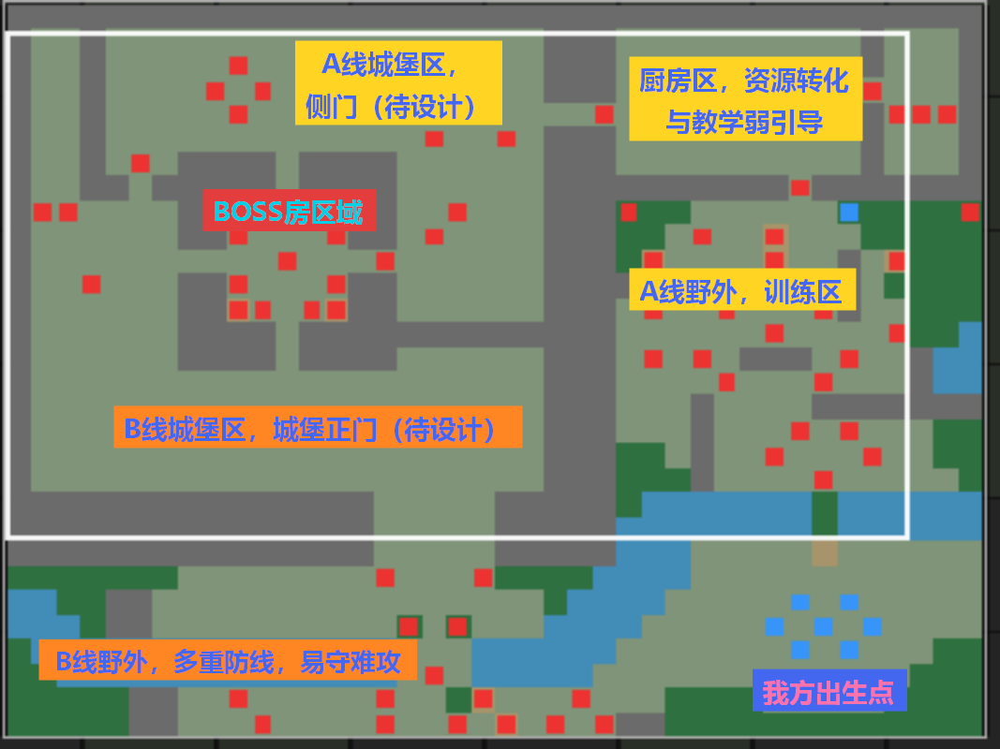
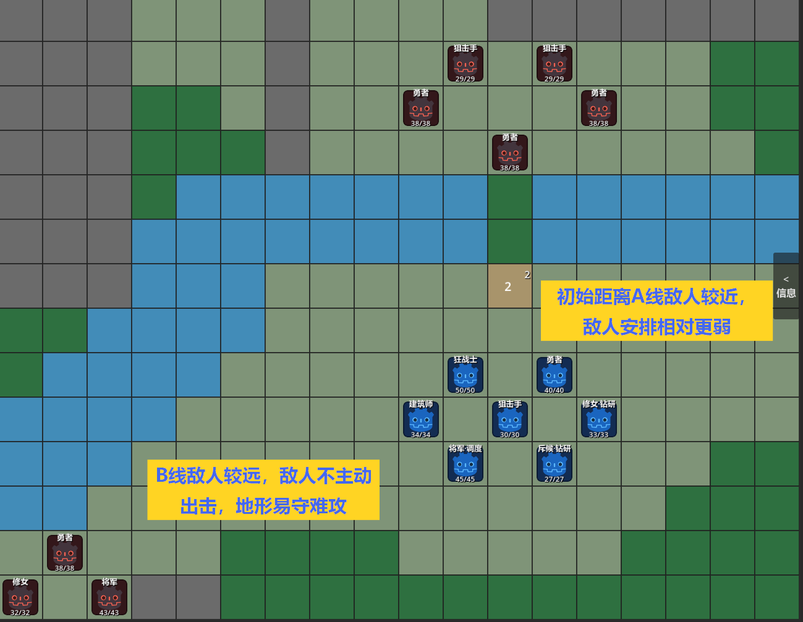
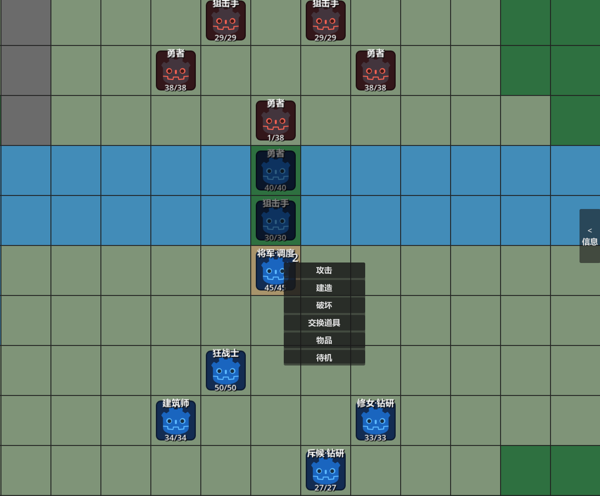
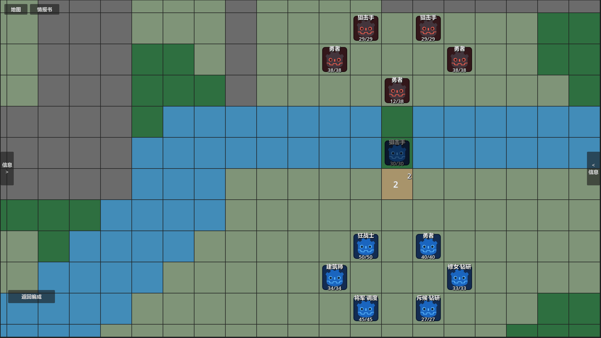
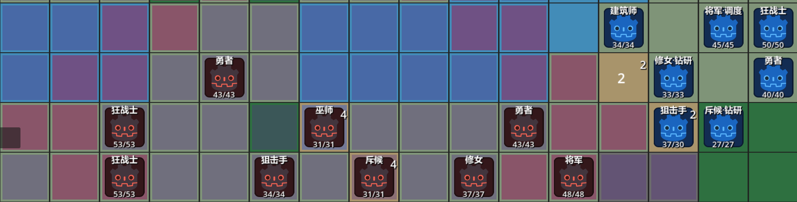
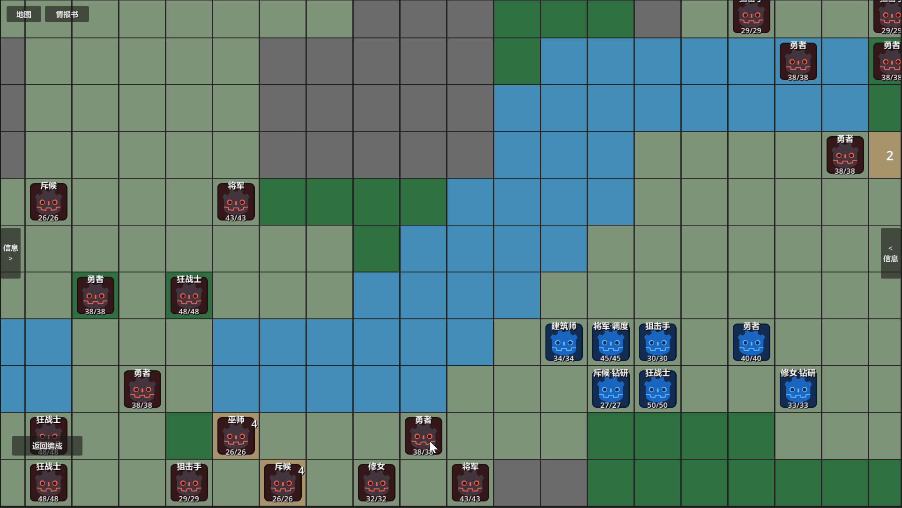
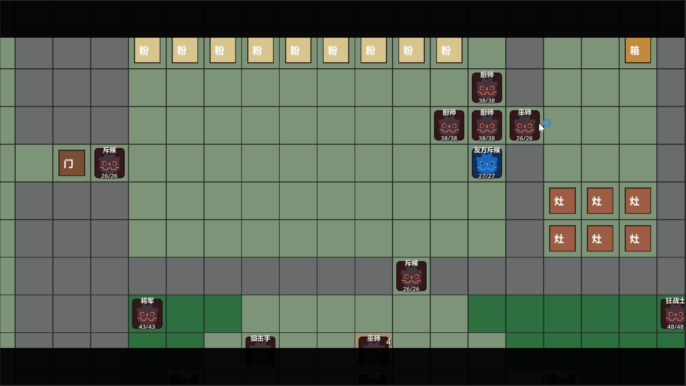

# 面粉关｜如何用路线、敌人职责与资源压力组织一张战棋关卡

> **案例类型：关卡设计 / 战斗设计 / 玩家行为引导**  
> **项目：《代号：地形》**  
> **关卡规模：40×30网格地图**  
> **主要展示：路线设计、敌人配置、软引导、空间控制、资源与战斗耦合**  
> **预计阅读：约 12 分钟**  
> **推荐阅读：关卡策划岗位优先；阅读前可先查看高台系统案例。**

[返回作品集首页](../../README.md) · [项目主页](01_项目概览.md) · [核心系统案例](02_核心系统_高台与地形博弈.md) · [迭代案例](04_设计迭代案例.md) · [原始工作文档](source-docs/README.md)

## 30 秒摘要

“面粉关”作为《代号：地形》的第一个大型纵向切片，它需要验证的是：**地形构筑、精确射程、职业技能、敌人配置、资源竞争与信息教学，能不能在同一张地图里真正互相发生作用。**

因此，这张地图被设计成了一个持续约一小时的中后期展开关卡：玩家从野外进入战场，在通往厨房的 A 线与直接攻入城堡的 B 线之间选择推进方向；厨房提供有限的面粉资源，敌方厨师也会持续搬运并使用这些资源；最终两条路线重新汇入城堡，并进入 Boss 房。关卡的难度可以较高，但我希望所有压力都能够被玩家读取和归因——失败应该来自路线、站位、击杀顺序或资源判断。

*40×30 白盒地图的完整分区。图中保留“待设计”区域，用于标明当前纵向切片已经覆盖的范围与仍在推进的边界。*

---

## 两条路线，两种不同的成本结构

**【设计目标】**  
**玩家最初会选择A 线还是B 线，按照一般的玩家行为惯性进行了设计。**A / B 两条路线首先承担的是一次软分流。

我希望**初见玩家更容易自然进入厨房**，接触关卡中的资源竞争与环境机制；但与此同时，**直接向城堡推进也必须是一条真正能够成立的攻略路线**，否则所谓“路线选择”最终仍然只是伪选择。为实现此目标，关卡初始结构上做了两项设计：

**第一，刻意将玩家初始位置靠近A线的主动索敌敌人，是为了引导玩家先处理A线。**玩家倾向于先处理高威胁、距离近的敌人，而延缓处理较低威胁、距离远的敌人；而主动出击的近处敌人，往往会具备较高优先级。而若玩家选择B线，A线第一波敌人的主动出击也会使得玩家的安全布阵时间减少，玩家要么先处理这部分敌人，要么就需要面临两拨敌人进攻。玩家吃到苦头后，会意识到双线攻关难度差异，从而自然走向A线。

**第二，两条路线的敌人配置、空间大小不同，导致路线的初始难度分化。**A 线在初始阶段承担较低的理解门槛：敌人以主动出击、中低质量和少技能单位为主，玩家可以比较自然地通过迎击、树林和预设高台建立对基础地形的认识，并逐渐接近显式地为敌人全体提供buff的厨房；B 线则直接提高空间压力，高层敌方高台覆盖接敌通道，精英单位阻挡推进位置，地形狭窄使得高台搭建地块稀缺，玩家需要更早开始考虑射程盲区、集中输出与阵地构筑；作为交换，这条路线也更早提供高价值装备与更直接的城堡推进机会。

这里的差异并不是简单的“简单路线 / 困难路线”。A 线看似更加稳健，却需要消耗时间绕向厨房；B 线风险更高，却能够更快取得装备、缩短部分推进距离。与此同时，厨房里的敌方厨师不会因为玩家选择另一条路线而停止行动：**路线选择会进一步改变玩家到达厨房时剩余多少面粉、敌方已经获得多少烹饪增益，以及之后进入城堡时面对怎样的战斗阈值。**在远期系统设计中，参考《明日方舟》的危机合约系统设计，也会为玩家提供成长后验证另一条推进路线的模式。

*玩家初始位置与 A / B 两线的首批敌人。近处主动索敌的 A 线首先争夺注意力，B 线则以更远、更完整的防守阵地提高直接攻城的门槛。*

---

## 敌人波次A1：向上推进，直逼厨房｜让玩家自己发现“这里搭高台会更好”

**【设计目标】**  
A1 是玩家进入关卡后的第一组完整战斗，因此它需要同时完成几件事：**控制初见难度、建立地形意识、让玩家感受到高台的价值，同时控制玩家接收的信息密度**。

A1 因此被放在一段“软狭窄”地形中：主要通路宽度有限，两侧浅滩提高横向移动成本，少量树林则为主动前压提供防御收益。这样的地图结构首先限制了玩家能够同时投入前线的单位数量——即使队伍拥有七人，也很难把所有单位一次性送到最有价值的位置。于是，**射程本身开始成为一种稀缺资源。**

敌人整体采用**中低质量、少技能配置**，但第一名最容易成为玩家集火目标的勇者带有“坚韧”：按照初始站位中最自然的一组攻击顺序，**玩家很可能把它打到只剩 1 HP，却发现后排单位已经因为距离不足无法继续补刀**。此时旁边预设的空高台会自然进入视野——玩家并没有收到“请在这里使用高台”的指令，但**只要利用它调整射程，就能够让原本无法参与战斗的单位完成最后一次攻击**。

如果玩家完全不使用这座高台也没有关系：敌人随后同样可能利用它，使**玩家从另一个方向感受到高度改变射程带来的压力**。树林、浅滩和高台因此不在一次很普通的交战里自然植入到玩家的思考中。

*A1 的软狭窄地形限制了多单位触达；预设高台让低移动、短射程单位仍有机会参与集火。*

*前排先将带“坚韧”的敌人压到 1 HP，原本触及不到目标的将军随后借助预设高台完成补刀。*

**【实机调整】**  
第一次试玩后，我发现理论上并不复杂的一组敌人，在实际进攻中却**给玩家带来了过高的生存压力**。问题并不是敌人数量本身，而是我方前排向前输出以后，后续敌人仍然较难快速触及，玩家会在完成教学以前先承受过多伤害。因此我**把部分原本的普通地面调整为树林，用地形本身增加玩家前压后的容错**。

---

## 敌人波次B1：向左推进，直入城堡｜同一个高台系统，反过来成为敌人的阵地

A1 让玩家在相对安全的环境里主动利用高台，B1 则反过来提出一个问题：**如果高台优势首先掌握在敌人手里呢？**

B1 的接敌区域更加狭窄，**高层远程敌人提前覆盖主要推进通道，前方精英单位则承担实体阻挡与近战压力**。玩家直接向前冲锋时，很容易同时进入多名敌人的攻击范围；但如果只停在外围，也需要面对敌方阵地持续保持完整的问题。因此玩家必须开始处理一个比 A1 更具体的空间问题：先拆谁，站在哪里，以及这一回合是否值得花一次行动搭建自己的高台。

这里仍然没有规定唯一解：
一层高台就可以显著改变某些单位的激活与攻击位置，**玩家能够通过提前进行高台施工集中火力解决前排精英**；
熟悉传统战棋的玩家也**可以通过计算危险范围、拉出部分敌人、利用地形和角色承伤逐步拆解阵地**；
吃过一次苦的玩家，下一次**在战前为此做更多的地形改造**也可以有效改变题面上的敌人移动距离。

敌方高台本身同样具有两面性：它能够为远程单位提供安全输出位置，但随着玩家突破前方阻挡，**敌方最小射程下降产生的“灯下黑”又会变成可以利用的安全区**。B1 的设计需要玩家对更多游戏机制进行熟练的理解和应用，因此初见玩家更难在此突破。

*B1 的敌方高台覆盖主要通路，但抬高后的最小射程也在阵地下方留下近身盲区。*

*玩家读取危险范围后进入高台远程单位的“灯下黑”，把敌方阵地的规则反过来变成推进空间。*

---

## 让关卡机制继续影响下一场战斗

A / B 两线，最明显的连接来自厨房。面粉总量有限，同一袋面粉**既可以在灶台中用于烹饪，取得持续性的属性收益，也可以保留下来撒入封闭空间，通过热源制造粉尘爆炸**。与此同时，敌方厨师会持续搬运并消耗同一批资源。因此玩家每在野外多花一个回合，厨房的状态都可能继续变化；而玩家真的进入厨房以后，又要重新决定：立刻把资源转化成数值，还是把它保存为之后攻克城堡和 Boss 房的战术工具。

*厨房事件先把“面粉能够爆炸”作为战场现象展示给玩家，再把是否主动复现、怎样利用留给玩家判断。*

所以这里真正形成的是一条连续决策链：

**路线选择 → 推进时间 → 厨房剩余资源 / 敌方强化 → 面粉用途选择 → 城堡与 Boss 房处理方式**

我希望通过这种设计，让“路线”“资源”“关卡机制”不要变成三个并排存在的设计。一个选择只有真正改变了之后的另一个选择，它才开始形成关卡结构。

这也是为什么忽视厨房本身必须能够通关。**如果玩家“不去厨房”就必然失败，那么厨师的搬运、敌方烹饪和 A / B 路线最终都只是伪装过的倒计时任务**；只有当玩家可以接受更高的敌方属性、更少的爆炸资源或不同的装备收益继续推进时，**风险—收益差异才真正构成路线，而不是一道必须执行的流程。**

---

## 当前结论｜设计不同答案的成本

目前 A1 / B1 已经进行了较充分的实机测试，而后续 A2、B2 与城堡区域仍在持续调整。这张关卡的设计也让我逐渐改变了自己摆放敌人的方式：早期我更容易凭直觉判断“这里需要几个敌人”“这里压力应该大一点”，现在则会先问**每组敌人究竟在改变玩家什么决策**——它是在限制安全站位、延迟推进、保护高价值单位，还是在逼迫玩家提前投入行动建立攻击位置？

我也越来越少追求“玩家按照我想象中的漂亮连招解题”。在实机中，玩家拥有七名单位、不同武器和技能组合，任何过度依赖精确站位的预设解都很容易因为一个额外行动而失效。相比预测玩家一定站在哪一格，我更愿意设计几个彼此不同的处理区间，然后让玩家自己决定：**搭台集中输出、主动前压、后撤拉扯、争夺厨房，或者干脆接受某些损失继续推进。**

只要这些选择都能够被规则解释，并且真正承担不同成本，我并不需要知道玩家最终会选择哪一个。

这也是我目前理解的战棋关卡设计：**先构造一组足够清楚的空间与资源关系，让玩家自己形成战术执行者。**

---

## 推荐继续阅读

**补充本关使用的系统前提：** [高台与地形改造系统](02_核心系统_高台与地形博弈.md)  
**继续查看问题归因与方案止损：** [设计迭代案例](04_设计迭代案例.md)  
**核验关卡原案、流程与验收标准：** [原始工作文档](source-docs/README.md)
