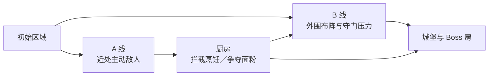

# 03｜面粉关如何组织引导、路线与多解性

[作品集首页](../../README.md) · [项目入口](README.md) · [01 项目概览](01_项目概览.md) · [02 核心系统](02_核心系统_高台与地形博弈.md) · **03 关卡设计** · [04 设计迭代](04_设计迭代案例.md)

> **预计阅读：** 速览约 1 分钟｜完整阅读约 8 分钟　　**重点展示：** 玩家引导、空间组织、节奏设计、多解结构与敌人配置

**电梯总结：**面粉关是一张包含野外、厨房和城堡的大型战棋地图。开局的 A、B 两条路线可以交叉：A 线通过近处的主动敌人引导初见玩家进入厨房，敌方厨师会把有限面粉加工成全军增益，形成持续的推进压力；B 线允许玩家在危险范围外布阵，再用堵口敌人、远处高台火力和自然分批到场的敌军检验阵地。玩家可以选择战前改造、战中搭台、争夺面粉、制造粉尘爆炸，或者依靠走位强行推进。整关围绕同一个目标组织：让不同投入对应不同解法，并让玩家愿意再想一遍“这张图还能怎么打”。

## 一、一张地图分三段，各自解决一个体验问题

面粉关从野外开始，经过厨房与城堡，最后进入 Boss 房。野外负责第一批敌人与路线判断；厨房负责面粉争夺和烹饪压力；城堡把高台、敌方施工和 Boss 警戒攻击叠加起来，检验玩家是否真正理解前面用过的空间规则。胜利目标是击败 Boss，玩家无需清空全图，也不必完成厨房目标，因此可以跳过部分区域、折返，或者混合推进。

A 线更适合初见玩家，B 线也可以从开局直接进入。选择 B 线后，A 线的主动敌人不会原地等待，它们会压缩玩家的安全布阵时间；玩家需要先回头处理，或者承受两侧敌军同时接战。由此，直攻城堡成为一条更难、但确实能够执行的路线。地图没有用门锁死选择，路线难度来自敌人的距离、激活方式与到场顺序。

## 二、A 线利用威胁感完成开局引导

初见玩家通常会优先处理即将造成伤害的敌人，再考虑远处暂时静止的单位。A 线第一波利用了这个习惯：玩家出生点更靠近一组会主动出击的敌人，“先解决眼前威胁”会自然地把队伍带向厨房。若玩家仍然选择 B 线，A 线敌人会继续前压，让路线选择表现为实际战斗压力。

这种引导允许玩家拒绝。强制封路或弹窗可以保证玩家先走 A 线，却会直接消除路线判断；完全不施加压力，则容易让两条路只剩距离差异。当前做法使用敌人位置和主动性建立倾向，既能给初见玩家一个较稳妥的方向，也给熟悉关卡的玩家保留绕开厨房、直接攻城的空间。

## 三、厨房把推进速度转化为资源和数值压力

敌方厨师会拾取面粉、搬运到灶台并完成烹饪。每次烹饪都会推进敌我共享的增益序列，为敌军恢复生命、提高生命上限或改变关键属性。玩家如果在外围花费过多回合，地图中的面粉会逐步变成敌方战力；例如速度增加可能直接改变 Boss 是否能够追击，少量属性变化也会让原本成立的击杀线失效。厨师本身不主动攻击，玩家可以从其行为中清楚识别它是一个资源压力源。

**厨房因此形成了一条隐性的时间轴：面粉只要还在，就代表敌人未来可能获得的战力。**玩家到达厨房时，我希望场上大约保留 2～3 包面粉。资源过多会让烹饪和爆炸都显得廉价，资源耗尽又会让玩家失去尝试空间。A 线敌人的数量、强度、厨师移动力和站位需要共同控制这个余量。

面粉还可以用于粉尘爆炸。玩家在封闭空间撒下面粉，再使用带有“热”标签的攻击，可以对其中单位造成高比例伤害并保留残局处理。烹饪与爆炸消耗同一种有限资源：前者提高整个队伍之后的稳定性，后者立刻打开某个高压房间。玩家选择其中一种用途，就会减少另一种用途的机会。

教学上，我会先让玩家看到敌人拾取、烹饪和面粉遇热爆炸的结果。玩家由此容易产生“我能不能也这样做”的想法，再通过自己的操作确认。开局只需把“应该阻止敌人使用面粉”传达到位，不急着告诉玩家“你应该怎样使用面粉”。现有较强提示用于功能验收，正式表达会更多依赖敌人行动、场景结果和可回看的情报。

情报书可以在玩家完成尝试后补充规则、记录当前增益序列，并通过角色吐槽或战场简报记录首次烹饪、首次爆炸。它同时承担机制查询和叙事反馈，文本口吻更接近战场日志。该系统属于后续信息呈现方向，当前关卡完成度不依赖它。

## 四、B 线用空间距离检验高台阵地

B 线敌军在玩家进入指定范围后开始行动，因此玩家可以先站在危险区外观察和布阵。入口有两名固定不动、击杀阈值较高的堵口敌人，通道相对狭窄；更远处还有高台单位和可移动敌人。如果玩家贸然冲入，即使当回合击杀两名堵口者，也很难同时解决远处火力，之后到场的移动敌人还会继续压迫阵线。

初见时较稳妥的办法，是在外围搭建约 2～3 层高台，先处理堵口敌人，再决定如何穿过入口。三层以内保留了治疗和阵地调整空间，射程又足以改变第一轮交战。玩家也可以在战前针对入口改造地形，或者采用更激进的站位抢攻关键敌人；高台是清楚的一种解法，却没有垄断入口。

后续敌人没有凭空刷新。它们从更远的初始位置出发，因为移动距离不同，自然形成两批到场时间。玩家能够从地图上看到这些单位，并预估它们何时进入战场，避免传统增援可能造成的信息黑盒。理想情况下，敌人会先停在玩家当前高台射程之外，下一回合再通过移动攻击威胁阵地，迫使玩家判断升高、前压或留守。

早期配置出现了一个明显偏差：玩家为堵口敌人搭起的高台，恰好能够覆盖后续单位的停留位置。每批敌人到场后都会进入同一条火力线，原定的推进压力变成了分批收割。**问题落在阵地的跨阶段复用：一次施工连续解决了多个敌群。**增加生命或攻击只能提高数字，无法改变这处阵地的覆盖关系；这个局面后来引出了复杂空间 AI 试验，完整复盘见[设计迭代篇](04_设计迭代案例.md)。

## 五、多解性来自不同投入之间的交换

我希望玩家通关后仍然会想“这一题还能怎样解”。为此，路线、面粉、战前改造、战中施工和基础走位需要消耗不同资源，并分别解决不同约束。各种方案无需拥有完全相同的难度；它们需要让玩家看清自己得到了什么，又为此放弃了什么。

| 解题方向 | 主要投入 | 获得的优势 | 需要承担的代价 |
| --- | --- | --- | --- |
| **先走 A 线、处理厨房** | 推进回合与兵力位置 | 抑制敌方强化，保留面粉，并较自然地学习机制 | 延后城堡推进，消耗前期行动。 |
| **开局直入 B 线** | 更高的即时操作与承压能力 | 更早接近城堡和高价值目标 | A 线敌人压缩布阵时间，容易形成双线压力。 |
| **战前地形改造** | 有限的战前配置额度 | 改善入口和第一轮攻击环 | 会放弃其它区域的改造机会，且更依赖事前判断。 |
| **战中搭建高台** | 单位行动、站位与回收时间 | 获得数回合的射程和阵地优势 | 可能错过即时攻击，高层还承担孤立／禁疗风险。 |
| **烹饪或粉尘爆炸** | 关卡内有限面粉 | 获得持续增益，或立刻打开局部高压空间 | 两种用途竞争同一资源。 |
| **基础走位与主动推进** | 生存空间与先手风险 | 不依赖特定角色和资源，也能完成基本解题 | 更考验威胁范围、行动顺序和伤害阈值。 |

这套结构也为远期的玩家自选限制挑战保留了空间。战棋的击杀、追击和生存阈值比较敏感，直接大幅增加敌人属性很容易破坏原有关卡。更合适的做法是提高一条路线或一种战术的实行成本：厨房更难控制、某类地形改造受到限制、某组敌人的到场关系发生变化，都可能让旧解失效。玩家需要重新寻找路线，也能看到同一张地图此前没有注意到的一面。

## 六、下一轮要验证什么

接下来的完整游玩会记录路线顺序、第一次主动使用高台的位置、施工回收的回合数、面粉去向、敌方烹饪进度、减员位置和 Boss 房解法。发现偏差后，再分别检查地图空间、敌人职责、数值阈值、触发时机和信息表达。例如，玩家始终不进厨房，可能来自奖励不足，也可能是厨师压力没有及时影响后续战斗；两者需要完全不同的修改。

当前尚未开展外部试玩，多解平衡也没有最终定稿。现阶段已经明确的是区域职责、路线逻辑、资源关系，以及人工实机中暴露出的结构性问题。正式投递视频和试玩切片会在完整路线稳定后制作，并优先截取基础教学与 B 线第一波，让面试官在有限时间内看到规则理解、布阵、推进和结果验证。

---

**上一篇：**[02｜高台如何从复合增益收敛为空间决策](02_核心系统_高台与地形博弈.md)　｜　**下一篇：**[04｜为什么放弃复杂敌人 AI 方案](04_设计迭代案例.md)
