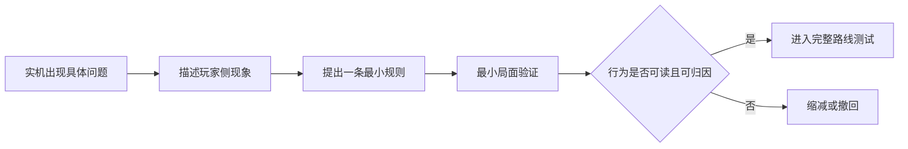

# 04｜为什么放弃复杂敌人 AI 方案

[作品集首页](../../README.md) · [项目入口](README.md) · [01 项目概览](01_项目概览.md) · [02 核心系统](02_核心系统_高台与地形博弈.md) · [03 关卡设计](03_关卡设计_面粉关.md) · **04 设计迭代**

> **预计阅读：** 速览约 45 秒｜完整阅读约 6 分钟　　**重点展示：** 实机诊断、方案取舍、及时止损与研发成本意识

**电梯总结：**B 线原本希望通过远处敌人的自然到场制造“下一回合将进入攻击范围”的压力，但玩家为处理堵口单位建立的高台阵地，可以继续无代价消灭后续敌群。为解决这一问题，我曾尝试让敌人综合多种空间收益决定推进或停留；实机却出现行为难以理解、异常难以归因、调参成本持续上升的问题。2026 年 9 月，我停止该方案，并将方法收敛为“一次只处理一个已出现的问题、简洁与可归因优先、先在最小局面验证”。本篇重点不是失败功能本身，而是如何判断继续投入已经不再值得。

## 一、先把“敌人太弱”改写成真正的问题

B 线开始时，玩家能够在危险范围外进行布阵。两名固定的高阈值敌人堵住狭窄入口，远处高台单位和可移动敌人则在之后形成压力；较远单位并非突然刷新，而是从既定空间位置出发，因移动距离不同自然分两波抵达。预期体验是：玩家用约 2～3 层高台处理堵口者后，后续敌人先停在当前火力网外，却能在下一回合移动并威胁阵地，迫使玩家判断继续升高、主动推进还是留在原地接敌。

实际测试中，玩家为第一批敌人投入的高台恰好能覆盖后续单位停留的位置。敌人每次到场都没有立即造成压力，反而依次进入同一条远程火力线，被玩家无反击消灭。原本用于形成时间差的空间安排，变成了方便玩家分批收割的节奏。

如果把问题简单归结为“敌人生命或攻击不够高”，最直接的改法是继续增加数值；但即使敌人多承受一次攻击，一次施工仍然在多个敌群上重复产生收益，路线结构并没有改变。真正的问题是：**既成阵地能够低成本地跨阶段复用，而敌人的移动没有迫使玩家重新评估阵地。**这个定义把调整对象从单个属性转向接敌位置、到场时间、威胁距离和敌人行为，也为后续方案提供了可检验目标。

## 二、复杂空间决策为什么在纸面上合理

当时的假设是：如果敌人能够识别玩家火力网边缘，就不必机械地走进既成阵地。于是试验方案让敌人同时考虑责任势能、静态火力风险、未来威胁、攻击收益、反击风险和破阵收益，再从候选位置中选择前进、停留、回撤或攻击点。它试图获得一种通用能力——敌人既能维持关卡职责，又能根据玩家阵地对空间作出更聪明的反应。

这个方向具有明显诱惑力，因为它似乎可以用一套模型解决多张地图的拉怪、白嫖和阵地复用问题，也比为每组敌人单独设计规则更“完整”。但其验收条件在早期写得不够严格：敌人考虑的变量变多，并不等于玩家获得了更好的策略题。如果玩家不能通过地图、危险范围和上一回合行动推测敌人为何停下或改变路线，就无法利用这套聪明行为；如果策划不能从异常结果反推是哪个变量造成偏差，也无法稳定配置和复用。

| 方案预期 | 实机表现 | 暴露的判断错误 |
| --- | --- | --- |
| 敌人避开静态火力网，迫使玩家换位 | 敌人会前进、停步或回撤，但行为意图不稳定 | 把“避开伤害”误当成“产生可读压力”。 |
| 多项收益共同给出更合理的位置 | 同一个异常可能来自公式、参数、候选生成或缓存结果 | 变量越多，越难进行单因果验收。 |
| 通用模型减少逐关配置成本 | 调参与回归验证不断占用敌人配置和完整路线测试时间 | 忽略了通用系统本身的维护成本。 |
| 更聪明的敌人增加博弈深度 | 玩家必须知道内部评分才能解释行动 | 计算复杂度没有转化为玩家可学习的规则。 |

## 三、停止方案的依据：不可读、不可归因、阻塞主线

2026 年 9 月 9 日的实机结果触及了项目对通用 AI 的底线：即使模型可以在内部解释自己的计算，只要玩家必须查看评分才能理解敌人为何前进、停步、回撤或选择某个攻击位置，它就没有形成可学习、可利用的战棋规则。同时，多项因素互相作用后，策划也无法把单个异常稳定归因到一项公式、一个权重、候选位置生成还是缓存结果。每修正一个局面，都可能需要重新检查其它路线与敌群。

继续投入的机会成本已经超过潜在收益。面粉关仍需要推进敌人站位、技能、数值、路线节奏和 Boss 房验证，而综合模型要求持续调参、补公式、维护例外并进行大范围回归。此时“已经投入很多”不是继续开发的理由；如果一个方案同时降低玩家可读性、策划可归因性并阻塞核心关卡，停止它本身就是制作决策。因此该方案被明确归档，不再作为当前敌人 AI 的调参目标，也不作为后续关卡设计的前置依赖。

归档并不等于其中所有技术尝试都毫无价值。未来如果某个局部能力能够解决清楚的单一问题，可以重新独立验证；但不会因为已有代码而继承整套综合模型。作品集也不以“做过复杂 AI”作为成果，而把可复用的产出定义为：更准确的问题、明确的停止条件，以及一套不会长期占用关卡制作时间的验证方法。

## 四、从失败方案沉淀出的迭代方法

后续敌人设计从“建立覆盖所有空间行为的通用评分”转为“针对实机中已经出现的玩家侧现象增加最小规则”。每次只回答一个问题：玩家是否能无限拉怪、是否能无反击处理关键单位、某组敌人是否失去路线职责。新增行为必须对应清楚的战场现象，使玩家能从行动本身意识到敌人正在防止什么，而不依赖责任点显示、评分 UI 或公式解释。

验证顺序也被重新限定。新规则先进入单一敌人、单一阵地、单一目标的最小局面，只观察目标问题是否改善；确认没有明显连带影响后，再回到 A／B 完整路线。若同一结果出现多种同样合理却难以区分的解释，应优先减少规则，而不是增加权重和特殊例外。AI 优化的时间也必须服从关卡主线：当它开始持续阻塞敌人配置、节奏和完整游玩，就需要暂停或回退。

这套方法也影响了其它设计判断。高台通用伤害加成因为不承担明确的核心决策而被移除，伤害收益转入建筑师技能；基础树林曾考虑通过隐藏索敌优先级制造保护，最终改为敌我对称、能够在战斗预测中理解的回避收益。它们规模不同，但判断标准一致：规则是否解决清楚的问题，玩家能否看到因果，策划能否用有限成本验证。

## 五、这个案例能够证明什么

对于系统策划，这次复盘说明我不会把规则覆盖面或数学完整性直接等同于设计质量；通用机制必须服务于玩家可理解的选择，并具备能够配置、验收和维护的边界。对于关卡策划，它说明敌人的职责、位置和接敌时机通常比“更聪明的统一 AI”更适合表达一道具体战术题。对于实际制作，它说明我会比较方案收益与验证成本，并在错误方向开始影响主线时主动止损，而不是不断追加补丁保护既有投入。

当前 B 线的最终解决方式仍会随完整关卡配置继续调整，但这不影响本次迭代已经得到的结论：正确的下一步不是立刻寻找另一套更复杂公式，而是回到堵口敌人、后续单位的停留位置、自然到场节奏和玩家既有阵地，逐项建立可观察、可复盘的局面。

---

**回到：**[《代号：地形》项目入口](README.md)　｜　**相关关卡：**[03｜面粉关如何组织引导、路线与多解性](03_关卡设计_面粉关.md)
