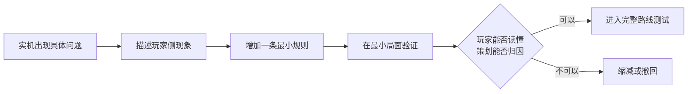

# 04｜为什么放弃复杂敌人 AI 方案

[作品集首页](../../README.md) · [项目入口](README.md) · [01 项目概览](01_项目概览.md) · [02 核心系统](02_核心系统_高台与地形博弈.md) · [03 关卡设计](03_关卡设计_面粉关.md) · **04 设计迭代**

> **预计阅读：** 速览约 45 秒｜完整阅读约 6 分钟　　**重点展示：** 实机诊断、方案取舍、及时止损与研发成本意识

**电梯总结：**B 线原本利用远处敌人的自然到场，制造“这一回合尚在射程外，下一回合就会威胁阵地”的压力。实际测试中，玩家为堵口敌人搭建的高台可以继续处理所有后续单位，整段压力被一次投资消化。为解决这个问题，我曾让敌人综合火力风险、未来威胁、攻击收益等因素选择位置；实机中的行动却越来越难理解，单个异常也无法稳定归因。2026 年 9 月，我停止继续调参，并将敌人设计方法调整为：一次只处理一个已出现的问题，先用最小局面验证，优先保证玩家可读和策划可归因。

## 一、问题从一个具体的 B 线局面开始

B 线允许玩家在危险范围外布阵。入口的两名固定敌人负责堵路，远处的高台单位负责压制，另外几名移动敌人从更远的位置出发，因为距离不同而自然分两批到场。预期节奏是：玩家先用约 2～3 层高台解决堵口者；后续敌人停在当前火力网外，并在下一回合移动攻击，迫使玩家升高、前压或准备接敌。

实际游玩时，玩家在入口搭好的高台正好覆盖了后续敌人的停留位置。第一批到场后被无反击处理，第二批也走进同一条火力线。敌人数量和到场顺序都存在，玩家感受到的压力却消失了。

最容易想到的办法是提高生命或攻击，但这只会让敌人多挨一次攻击。**真正需要处理的是高台阵地的跨阶段复用：玩家只支付了一次施工成本，却连续获得了多个敌群的安全攻击机会。**明确这一点后，调整对象也从单个数值扩大到敌人的停留位置、到场时间、威胁距离和移动行为。

## 二、为什么会提出综合空间评分

当时的思路是让敌人识别玩家火力网，避免机械地走进既成阵地。试验方案把守住责任区域的价值、静态火力风险、未来威胁、攻击收益、反击风险和破阵收益同时纳入位置评分，再由敌人决定前进、停步、回撤或选择攻击点。如果这套方法成立，同一套底层能力还可以处理拉怪、无反击白嫖和阵地复用等相近问题。

方案在纸面上比较完整，也因此掩盖了验收标准的问题。敌人计算更多因素，只能说明决策过程更复杂；玩家是否获得了更清楚、更有趣的战术题，需要另外验证。举例来说，敌人因为静态火力风险停在原地，在内部评分上完全合理；玩家若看不到这项评分，只会疑惑它为什么突然不再推进，也就无法有意识地诱导或反制。

## 三、实机结果暴露了三项失败

2026 年 9 月 9 日的测试中，敌人会因为多项收益竞争而前进、停步、回撤或更换攻击位置。问题很快集中到三处：

1. **玩家看不懂。** 战场表面没有足够信息解释行动原因，敌人行为很难被学习和利用。
2. **策划难归因。** 同一个异常可能来自公式、权重、候选位置生成或缓存结果，很难只修改一项后完成验收。
3. **验证成本失控。** 每次调参都需要重新检查不同路线与敌群，开始挤占敌人配置、路线节奏和 Boss 房测试。

| 原先预期 | 实机表现 | 得到的判断 |
| --- | --- | --- |
| 敌人避开静态火力网，迫使玩家转换阵地 | 敌人会改变行动，但玩家无法从地图上理解原因 | 空间规避需要转化为可见规则，内部合理仍然不够。 |
| 多项收益共同找到更好的位置 | 单个异常可能由多项因素共同造成 | 无法稳定归因的模型很难进入关卡生产。 |
| 通用模型减少逐关配置 | 调参与回归范围持续扩大 | 通用系统本身也有维护成本。 |
| 行为更聪明，博弈会更深 | 玩家必须阅读内部评分才能解释结果 | 玩家可读性比计算变量数量更重要。 |

这次结果触及了项目对通用 AI 的底线：**敌人的行动需要通过内部评分才能解释时，它就没有形成可供玩家学习的战棋规则。**战棋允许敌人复杂，但复杂关系要能够从危险范围、技能说明、站位和行动顺序中被推演。

## 四、我为什么在这里停止继续投入

面粉关仍然需要推进敌人站位、技能、数值、路线节奏和 Boss 房。综合模型则要求继续调权重、补公式、维护例外，并对多个路线做回归。它可能在某个局面得到更理想的移动，却已经开始拖慢关卡主线。

我在归档时采用了三个停止标准：玩家无法从战场表面理解行为；策划无法把异常稳定归因到单一规则；后续验证成本明显高于可能得到的收益。三项同时出现后，继续投入只会用更多参数保护既有工作。方案因此被完整停止，不再作为当前 AI 的调参目标，也不再成为后续关卡设计的前置任务。

已有实现作为失败样本保留。未来若某个局部能力能够解决清楚的单一问题，可以重新拆出来验证；整套综合模型不会因为已经写完一部分就被默认继承。**本次迭代真正留下的成果，是更准确的问题、清楚的停止条件和新的验证顺序。**

## 五、后续敌人设计怎样推进

新的方法从玩家侧现象开始。比如玩家能够无限拉怪、能够稳定无反击处理关键单位，或者某组敌人在特定路线下失去职责；每次只选择其中一个问题，再增加一条最小规则。敌人的行动需要让玩家意识到它在防止哪种策略，例如警戒范围迫使玩家换位，固定守门职责阻止玩家安全进入，而无需显示一组责任点或空间评分。

规则先进入单一敌人、单一阵地、单一目标的最小局面，只观察目标问题有没有改善。通过后再放回 A／B 完整路线，检查其它敌群和路线是否受影响。若一个结果出现多种同样合理、无法区分的解释，就优先减少规则。AI 调整也要服从关卡进度，一旦持续阻塞敌人配置和完整游玩，就暂停或回退。

这套标准也被用于其它设计。高台通用伤害没有承担清楚的核心决策，于是伤害转入建筑师技能；基础树林原本考虑使用隐藏索敌优先级提供保护，最后改成敌我对称、能够在战斗预测中读懂的回避收益。三个案例规模不同，检查的内容一致：规则解决了什么问题，玩家能否看到因果，策划能否用有限成本完成验证。

## 六、对应的岗位能力

对系统策划来说，这次复盘说明我会区分计算复杂度和实际体验，通用机制还需要满足配置、验收与维护要求。对关卡策划来说，敌人职责、站位、触发时机往往比统一的“聪明 AI”更适合表达一道具体战术题。对实际制作来说，方案收益需要和验证成本一起考虑；当一个方向持续影响核心关卡推进时，我会明确归档并停止投入。

B 线仍会随着完整关卡继续调整。下一步会回到堵口敌人、后续单位的停留位置、自然到场节奏和玩家既有阵地，逐项建立能够观察和复盘的局面，而不会立刻寻找另一套更复杂的综合公式。

---

**回到：**[《代号：地形》项目入口](README.md)　｜　**相关关卡：**[03｜面粉关如何组织引导、路线与多解性](03_关卡设计_面粉关.md)
